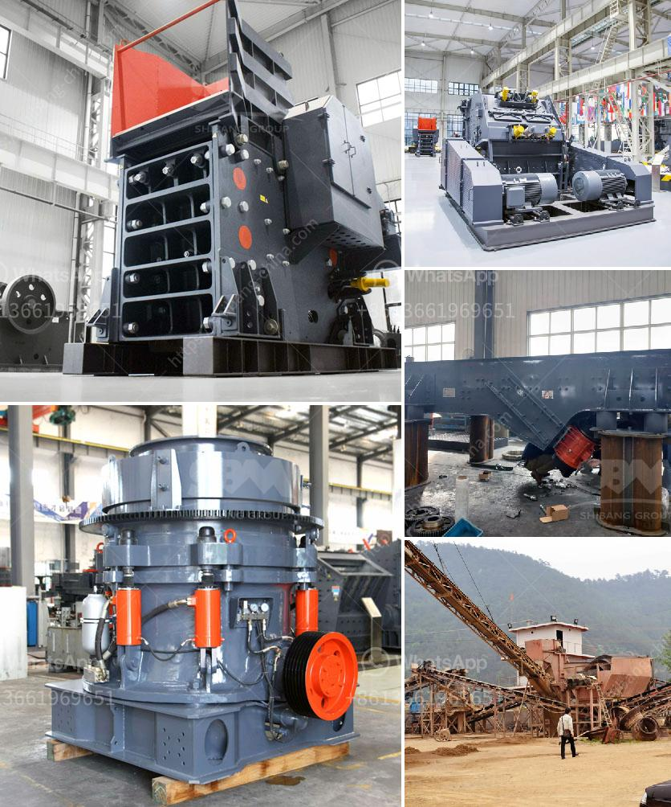

<h3>rock crusher for sale in sudan</h3>
Rock crusher is a main equipment in rock crushing process. It is used to crush large size rocks into smaller particles for further processing in the mining industry. Rock crusher can process many kinds of materials, such as granite, quartz, limestone, gypsum, gravel, basalt, concrete, etc. It has wide applications in metallurgical, construction, road building, chemical and phosphatic industry.

The rock crusher for sale in Sudan is a great investment for small scale and medium scale miners. It supports one-time mining projects, as well as large-scale continuous mining operations. Based on customer feedback, the rock crusher for sale in Sudan is highly praised for its features. It has the advantages of low noise, low energy consumption, simple structure, reliable performance, and easy maintenance.

One of the key features of the rock crusher for sale in Sudan is its adjustable discharging size. Different discharging sizes can be achieved by adjusting the gap between the impacting plate and the rotor. This feature allows customers to produce different sizes of finished products according to their specific requirements. Moreover, the rock crusher for sale in Sudan has a high crushing ratio, which means that it can break large stones into smaller ones with a minimum of fines production.

In addition to its adjustable discharging size and high crushing ratio, the rock crusher for sale in Sudan is also equipped with a hydraulic system. The hydraulic system allows for easy and fast adjustment of the apron gap, which ensures consistent product size and shape. This feature is especially important for customers who require high-quality aggregates for their construction projects.

Furthermore, the rock crusher for sale in Sudan is designed with a heavy-duty rotor. The rotor is made of high-quality steel and is heat-treated for increased durability. This ensures that the rock crusher can withstand the harsh mining environment and operate efficiently for an extended period of time.

Another notable feature of the rock crusher for sale in Sudan is its low operating cost. It consumes less energy compared to other crushers, which results in lower electricity bills. Additionally, the rock crusher requires minimal maintenance and has a long service life, reducing the need for frequent replacement of parts.

In conclusion, the rock crusher for sale in Sudan is an ideal choice for customers who are looking for a cost-effective and reliable crushing equipment. It offers adjustable discharging size, high crushing ratio, hydraulic system, heavy-duty rotor, low operating cost, and long service life. With all these features, the rock crusher for sale in Sudan is suitable for various mining applications and can bring significant benefits to the mining industry in Sudan. Whether it's for small-scale mining projects or large-scale continuous mining operations, the rock crusher for sale in Sudan is a smart investment.
<h3>Contact us</h3><ul><li><strong>Whatsapp:&nbsp;<a href="https://wa.me/8613661969651">+8613661969651</a></strong></li><li><a href="https://swt.shibang-china.com/?git&amp;zhl&amp;rock crusher for sale in sudan"><strong>Online Service(chat now)</strong></a></li></ul><h3>Related</h3><ul><li><a href='cone crusher in china cone.md'>cone crusher in china cone</a></li><li><a href='ball mill manufacturers in bangalore machinery.md'>ball mill manufacturers in bangalore machinery</a></li><li><a href='conveyor belt manufacturing plant crushers equipment.md'>conveyor belt manufacturing plant crushers equipment</a></li><li><a href='used limestone milling machine.md'>used limestone milling machine</a></li><li><a href='high efficiency manganese ore raymond mill in india.md'>high efficiency manganese ore raymond mill in india</a></li></ul>