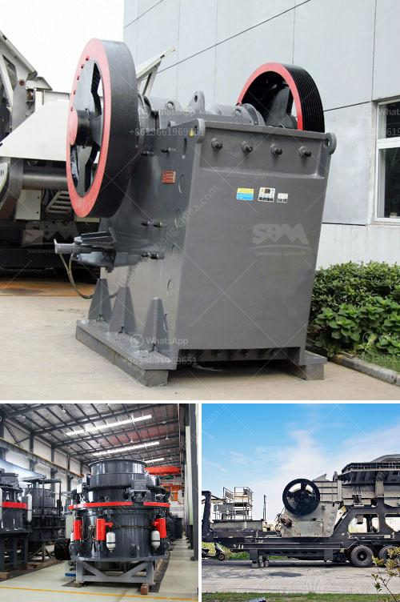

<h3>rock crusher from china</h3>
Rock crushers, also known as stone crushers, are machines that break down large rocks into smaller pieces. Made in China, these machines are renowned for their efficiency and durability. With various types, including jaw, impact, cone, and hammer crushers, these machines can easily demolish rocks of different hardness levels. Moreover, China's rock crushers are ideal for recycling construction waste and stones.

One of the distinctive features of these crushers is their strong and reliable performance, even in the toughest conditions. Whether used in mining, quarrying, or road construction, these machines consistently deliver high production rates and exceptional crushing capabilities. They are designed to handle large volumes of material, with a high crushing ratio and a uniform product size.

China's rock crushers are known for their low operating costs, making them a cost-effective solution for crushing applications. The crushers have a simple design with various options and customization choices. Additionally, the rock crushers made in China have a wide range of applications in various industries such as mining, construction, road construction, and more.

Furthermore, these crushers are equipped with innovative features that enhance their overall performance. For instance, some models include a hydraulic adjusting system, which allows for easy adjustment of the crusher's settings to achieve the desired product size. This feature not only increases productivity but also reduces downtime.

In conclusion, rock crushers from China are highly efficient machines designed to meet the needs of various industries. These machines have strong and reliable performance, low operating costs, and can handle different types of materials. When it comes to rock crushing, China's crushers are a reliable option.
<h3>Contact us</h3><ul><li><strong>Whatsapp:&nbsp;<a href="https://wa.me/8613661969651">+8613661969651</a></strong></li><li><a href="https://swt.shibang-china.com/?git&amp;zhl&amp;rock crusher from china"><strong>Online Service(chat now)</strong></a></li></ul><h3>Related</h3><ul><li><a href='machines use for mining sand from river.md'>machines use for mining sand from river</a></li><li><a href='basalt mobile crusher price price.md'>basalt mobile crusher price price</a></li><li><a href='density of crushed hornfels basalt granite.md'>density of crushed hornfels basalt granite</a></li><li><a href='limestone quarry operations.md'>limestone quarry operations</a></li><li><a href='companies rent vibrating screens.md'>companies rent vibrating screens</a></li></ul>