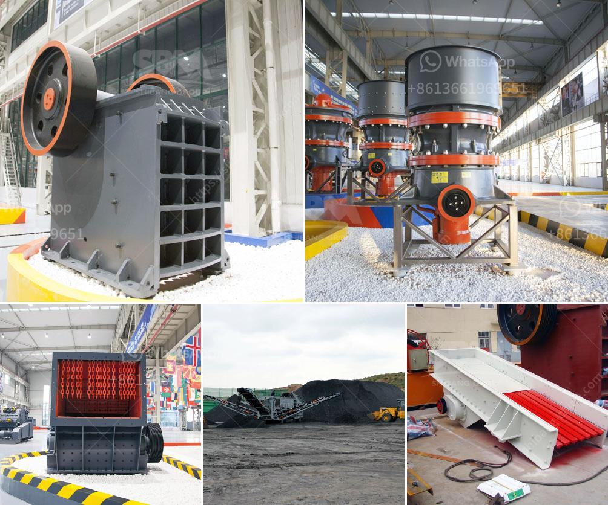

<h3>rock crusher in africa</h3>
Africa is rich in natural resources, which have been utilized for millennia by its inhabitants. Today, this continent is experiencing a resurgence in mining activities, fueled by the growing demand for minerals. Crushers are essential tools in this process as they break down large rocks into smaller, more manageable pieces. With their robust construction and powerful capabilities, rock crushers play a crucial role in extracting minerals and maximizing resource utilization in Africa.

One of the primary benefits of rock crushers is their ability to produce aggregate materials for various industries, including construction and infrastructure development. Africa is undergoing significant urbanization and industrialization, necessitating the construction of roads, buildings, and other structures. Rock crushers facilitate this process by producing crushed rock that can be used as a base material for road construction, concrete production, and other applications.

Additionally, rock crushers are instrumental in extracting valuable minerals from the earth. Africa boasts an abundance of mineral resources, including gold, diamonds, and copper, among others. These minerals serve as key components in various industries such as mining, jewelry manufacturing, and electronics. Rock crushers efficiently break down ores and facilitate their extraction, enabling the mining industry to thrive and contribute to Africa’s economic growth.

Moreover, the advent of advanced rock crushers has enhanced the safety and efficiency of mining operations across Africa. Modern crushers are equipped with advanced features such as automated control systems, remote operation capabilities, and improved safety mechanisms. These innovations not only increase productivity but also protect the well-being of workers, reducing accidents and ensuring safer mining practices.

In conclusion, rock crushers are invaluable tools in unlocking Africa’s natural resources. They are indispensable for producing construction materials, extracting valuable minerals, and ensuring safer mining operations. With the continent's growing demand for minerals and infrastructure development, the role of rock crushers in Africa will only continue to expand. Investing in these machines will not only bolster Africa’s mining sector but also contribute to its overall economic development and prosperity.
<h3>Contact us</h3><ul><li><strong>Whatsapp:&nbsp;<a href="https://wa.me/8613661969651">+8613661969651</a></strong></li><li><a href="https://swt.shibang-china.com/?git&amp;zhl&amp;rock crusher in africa"><strong>Online Service(chat now)</strong></a></li></ul><h3>Related</h3><ul><li><a href='conveyor belts in the construction.md'>conveyor belts in the construction</a></li><li><a href='ton per hour gold wash plant.md'>ton per hour gold wash plant</a></li><li><a href='gypsum factory machines in india.md'>gypsum factory machines in india</a></li><li><a href='china top limestone crusher brands.md'>china top limestone crusher brands</a></li><li><a href='stone crusher plant philippines.md'>stone crusher plant philippines</a></li></ul>