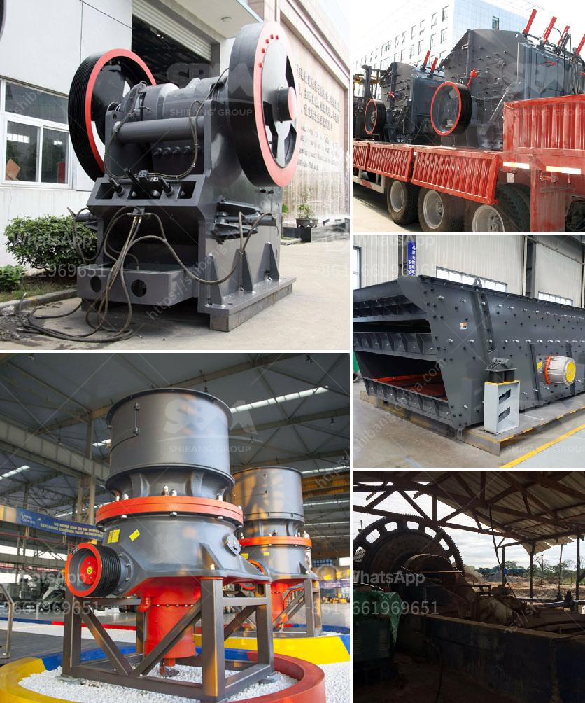

<h3>rock crusher in antioquia rock</h3>
In the beautiful region of Antioquia, Colombia, lies a revolutionary tool that has transformed the construction industry. The rock crusher, a mechanical device used to break rock into smaller pieces, has become an invaluable asset for contractors and builders alike.

Antioquia, known for its natural beauty and stunning landscapes, is also a hub for construction projects. With the need for high-quality building materials, the demand for the rock crusher has skyrocketed. This powerful machine has made it possible to efficiently crush large rocks into gravel, sand, or smaller stones.

One of the key advantages of the rock crusher is its versatility. From construction sites to road-building projects, it is the go-to tool for shaping the earth's surface. Whether it is crushing rocks, concrete, or asphalt, the rock crusher can handle it all, providing contractors with a one-stop solution for their material needs.

Moreover, the rock crusher has streamlined the construction process. It eliminates the need for manual labor and significantly reduces the time required to break down large boulders. This time-saving feature allows projects to progress at a faster pace, ultimately saving both time and money for contractors.

The rock crusher also plays a vital role in environmental sustainability. By recycling concrete and asphalt waste, it helps reduce the consumption of virgin materials, contributing to the preservation of natural resources. Additionally, the rock crusher's efficient design minimizes dust and noise pollution, keeping the surrounding environment clean and free from disturbances.

The advent of the rock crusher has brought numerous benefits to the construction industry in Antioquia. It has revolutionized the way projects are carried out by making them more efficient, cost-effective, and environmentally friendly. With its powerful capabilities and versatility, this machine has become an indispensable asset for contractors looking to deliver quality projects on time.

In conclusion, the rock crusher in Antioquia has proven to be a game-changer for the construction industry. With its ability to crush rocks, concrete, and asphalt, it has become the go-to tool for contractors and builders. This revolutionary machine has made construction projects more efficient, more cost-effective, and more sustainable. It is indeed a valuable asset that continues to shape the region's infrastructure for a brighter future.
<h3>Contact us</h3><ul><li><strong>Whatsapp:&nbsp;<a href="https://wa.me/8613661969651">+8613661969651</a></strong></li><li><a href="https://swt.shibang-china.com/?git&amp;zhl&amp;rock crusher in antioquia rock"><strong>Online Service(chat now)</strong></a></li></ul><h3>Related</h3><ul><li><a href='want to increase productivity for stone crushers.md'>want to increase productivity for stone crushers</a></li><li><a href='stone sand making machine.md'>stone sand making machine</a></li><li><a href='quartz powder manufacturing process.md'>quartz powder manufacturing process</a></li><li><a href='mineral processing equipment.md'>mineral processing equipment</a></li><li><a href='best stone crushers india.md'>best stone crushers india</a></li></ul>