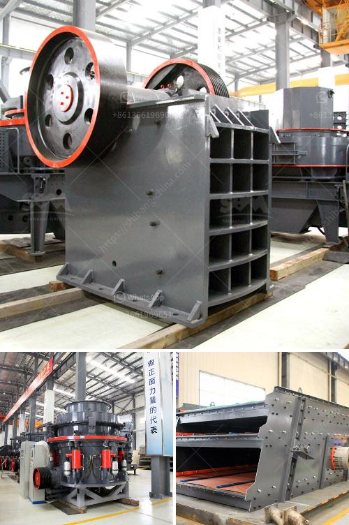

<h3>rock crusher machine equipment in canada</h3>
Rock crushing machines are widely utilized in the mining sector for reducing large rocks into smaller rocks, gravel, or rock dust. These machines are highly efficient and have become popular in recycling applications as well. Canada is home to a significant number of rock crusher manufacturers who produce high-quality machines for various applications.

One of the most popular rock crusher machines in Canada is the Cobra 230R. This versatile and powerful machine features a horizontal shaft impactor (HSI) and has the ability to process a variety of materials, including asphalt, concrete, and limestone. The Cobra 230R is equipped with a direct drive system, which offers excellent fuel efficiency and reduces maintenance costs.

Another popular choice for rock crushing machines in Canada is the Keestrack B3. This machine is highly efficient, compact, and offers a high production rate even in the toughest conditions. The Keestrack B3 features a hybrid diesel-electric drive system, which provides low fuel consumption and emits low levels of noise and pollutants.

In addition to these top-rated machines, Canada also has several specialized rock crushing equipment options. For instance, the Tesab 623CT is a compact impact crusher that is particularly suited to recycling applications. It features heavy-duty construction, easy maintenance, and excellent performance.

The rock crusher machine industry in Canada is highly competitive and constantly evolving, with manufacturers constantly looking for ways to improve their machines. These machines are essential for mining operations, construction projects, and recycling applications. With the advancements in technology, these machines are becoming more efficient, cost-effective, and environmentally friendly.

In conclusion, Canada is a hub for high-quality rock crusher machines. These machines are used in various industries, including mining and recycling, and offer efficient and reliable performance. Manufacturers continue to innovate and improve their machines to meet the ever-growing demands of these industries.
<h3>Contact us</h3><ul><li><strong>Whatsapp:&nbsp;<a href="https://wa.me/8613661969651">+8613661969651</a></strong></li><li><a href="https://swt.shibang-china.com/?git&amp;zhl&amp;rock crusher machine equipment in canada"><strong>Online Service(chat now)</strong></a></li></ul><h3>Related</h3><ul><li><a href='ball mill how to grind mineral.md'>ball mill how to grind mineral</a></li><li><a href='small cone crushers.md'>small cone crushers</a></li><li><a href='ballast quarry crusher machines.md'>ballast quarry crusher machines</a></li><li><a href='conveyor belts in the construction.md'>conveyor belts in the construction</a></li><li><a href='chromium ore mining equipmentr.md'>chromium ore mining equipmentr</a></li></ul>