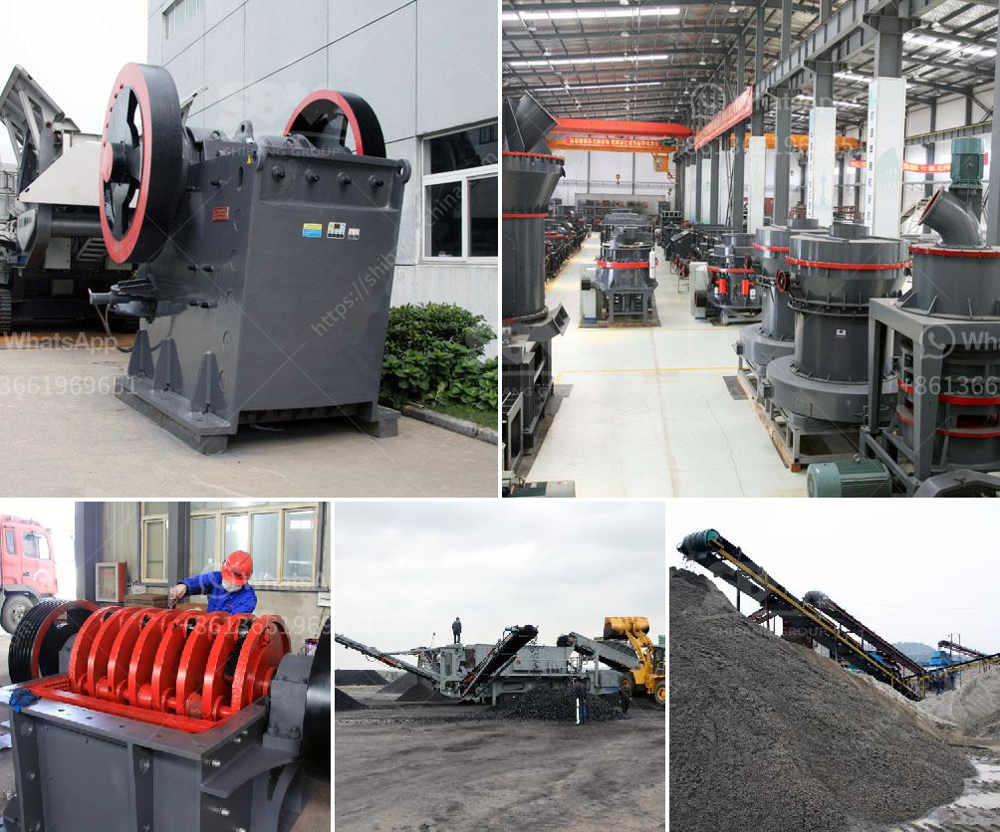

<h3>rock crusher mobile machine</h3>
The emergence of rock crusher mobile machines in recent years has revolutionized the mining industry in many ways. Not only does it provide efficient and safer ways to extract valuable resources, but it also significantly reduces the environmental impact associated with traditional mining methods. In this article, we delve deeper into the features and benefits of rock crusher mobile machines.

One of the key advantages of a mobile rock crusher is its portability. Traditional crushers are often large and bulky, making it difficult to transport them to different mining sites. However, a mobile rock crusher can be easily transported to any location, enabling mining companies to quickly set up mining operations in various remote areas. This flexibility allows for faster resource extraction and increased productivity.

Another significant advantage of rock crusher mobile machines is their versatility. These machines can crush a wide range of materials, including rocks, ores, and even construction waste. This versatility means that they can be used in a variety of industries, from mining and quarrying to construction and demolition. Additionally, the ability to adjust the size of the crushed material makes these machines suitable for different applications and downstream processes.

Furthermore, rock crusher mobile machines are designed to enhance safety in mining operations. Traditional crushers often require workers to be in close proximity to the machine, putting them at risk of accidents and injuries. Mobile machines, on the other hand, can be operated remotely, minimizing the exposure of workers to hazardous environments. Additionally, these machines are equipped with advanced safety features, such as emergency stop buttons and automatic shutoff systems, further reducing the risk of accidents.

In terms of environmental impact, rock crusher mobile machines are a game changer. Traditional mining methods involve significant land disturbance and the release of harmful emissions. In contrast, mobile crushers have a smaller footprint and produce lower emissions, helping to minimize the overall environmental impact. Furthermore, the ability to crush materials directly at the mining site eliminates the need for transporting excavated materials to off-site processing facilities, further reducing energy consumption and associated carbon emissions.

In conclusion, rock crusher mobile machines have brought numerous benefits to the mining industry. Their portability, versatility, and safety features have made them indispensable tools for mining companies operating in remote areas. Additionally, their lower environmental impact makes them a sustainable choice for resource extraction. As the mining industry continues to evolve, rock crusher mobile machines are likely to play an increasingly important role in transforming how we extract valuable resources from the earth.
<h3>Contact us</h3><ul><li><strong>Whatsapp:&nbsp;<a href="https://wa.me/8613661969651">+8613661969651</a></strong></li><li><a href="https://swt.shibang-china.com/?git&amp;zhl&amp;rock crusher mobile machine"><strong>Online Service(chat now)</strong></a></li></ul><h3>Related</h3><ul><li><a href='small sized cement plant project cost in india.md'>small sized cement plant project cost in india</a></li><li><a href='impact crusher design.md'>impact crusher design</a></li><li><a href='belt conveyor cost per meter of installation.md'>belt conveyor cost per meter of installation</a></li><li><a href='labratory hammer mill.md'>labratory hammer mill</a></li><li><a href='grinding mills jalandhar.md'>grinding mills jalandhar</a></li></ul>