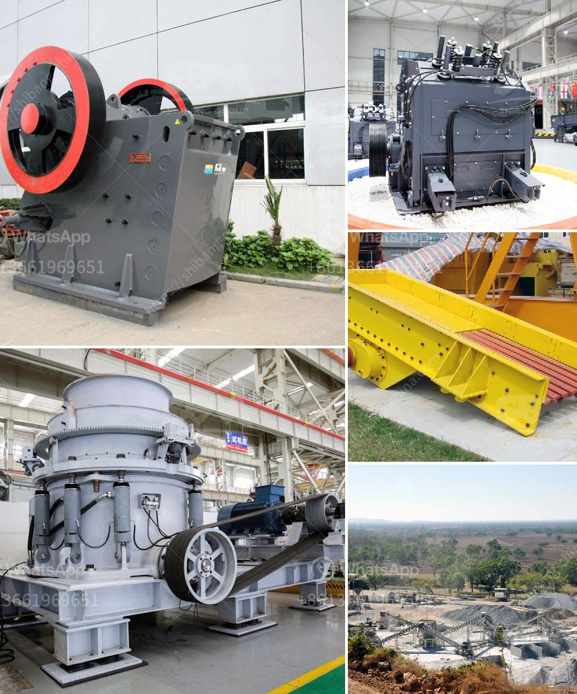

<h3>rock crushing plant 100tph</h3>
A rock crushing plant is a facility that processes large rocks into smaller aggregate materials. These plants can be divided into different types, each of which is specifically suited for certain applications. The 100tph capacity stone crusher plant is versatile and widely used for crushing hard rock material.

Crusher plants are machines designed to reduce the size of rocks and stones by applying force to them. This force is achieved by breaking rocks against rigid surfaces. Different types of crusher plants are available for various applications, such as quarries, mining, and recycling. If you are involved in these industries or have a need for crushed material, investing in a rock crushing plant can be a favorable choice.

A 100tph rock crushing plant offers a great advantage in terms of production capacity. It enables a quick start-up and requires minimal installation and commissioning. This plant includes a hopper design that can handle initial crushing and reduces the need for secondary crushing. The plant is self-sufficient, allowing for easy mobility and transportation to different sites.

A typical rock crushing plant consists of primary crusher, secondary crusher, and screeners. Primary crushers are the initial crushers that break down rocks into smaller pieces. They are designed to handle large rocks and produce a consistently sized product. Secondary crushers further process the crushed material after it has been reduced in size. Screeners separate the crushed material according to its size and specifications.

A 100tph rock crushing plant provides a cost-effective solution to process various materials such as granite, limestone, basalt, pebble, and river stone. It can produce high-quality aggregate material used in various construction applications such as concrete and asphalt production, road base, erosion control, and landscaping. The crushed material can also be used in the mining industry for further processing or as a raw material for cement production.

Besides the economic advantages, using a rock crushing plant also has environmental benefits. Recycling crushed materials reduces the need for new mining operations, thereby minimizing the impact on natural resources. Additionally, the use of recycled materials helps in reducing landfill waste and promoting sustainable practices.

A 100tph rock crushing plant is a versatile and commonly-used configuration for processing hard rock materials. It offers a cost-effective solution for producing high-quality aggregate material for various construction applications. Investing in a rock crushing plant can be a wise decision for industries like quarries, mining, and recycling. Not only does it provide economic advantages, but it also offers environmental benefits. With minimal installation and quick start-up, a rock crushing plant can be a valuable asset to your business.
<h3>Contact us</h3><ul><li><strong>Whatsapp:&nbsp;<a href="https://wa.me/8613661969651">+8613661969651</a></strong></li><li><a href="https://swt.shibang-china.com/?git&amp;zhl&amp;rock crushing plant 100tph"><strong>Online Service(chat now)</strong></a></li></ul><h3>Related</h3><ul><li><a href='fdiferentes areas of stone crusher.md'>fdiferentes areas of stone crusher</a></li><li><a href='mobile stone crusher for sale in philippines.md'>mobile stone crusher for sale in philippines</a></li><li><a href='roller mill advantages.md'>roller mill advantages</a></li><li><a href='quartz crushing machine cost.md'>quartz crushing machine cost</a></li><li><a href='lime stone crusher spesifikasi.md'>lime stone crusher spesifikasi</a></li></ul>