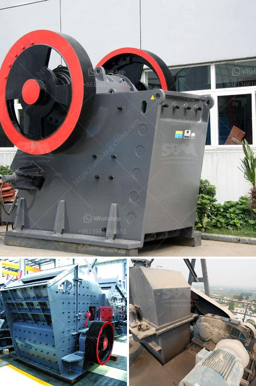

<h3>rock grinding equipment for sale in texas</h3>
Texas, known for its rich and diverse geological history, has always been a hub for exploration and mining activities. As a result, there is a constant demand for high-quality rock grinding equipment to meet the ever-growing needs of the industry. Thankfully, Texas offers a plethora of options when it comes to finding the right equipment, making it an ideal destination for those looking to purchase rock grinding equipment.

Rock grinding equipment is essential for various applications, from breaking down large rocks into smaller, more manageable sizes to extracting valuable minerals. These equipment are widely used in mining, construction, and excavation projects, among others. The need for reliable, efficient, and durable rock grinding equipment is crucial to ensure smooth operations and maximize productivity.

In Texas, finding rock grinding equipment for sale is a relatively easy task, considering the state's vast resources and commitment to mining. Numerous suppliers, manufacturers, and dealers cater to the needs of the industry, providing a wide range of options for potential buyers. These suppliers offer various types of rock grinding equipment, including crushers, grinders, pulverizers, and more.

One of the primary considerations when purchasing rock grinding equipment is the specific needs of the project. The type and size of the rocks being processed, the required output size, and the desired efficiency level all contribute to the choice of equipment. Moreover, factors such as budget, maintenance requirements, and after-sales support should also be taken into account.

Texas-based companies offer a diverse range of rock grinding equipment, ensuring that buyers can find the equipment that best fits their requirements. Whether it is a small-scale project or a large mining operation, Texas suppliers can provide solutions that cater to all needs. These companies are backed by years of industry experience and expertise, making them reliable partners in the procurement process.

Apart from the availability of equipment, another advantage of buying rock grinding equipment in Texas is the extensive support and service network. Partnering with local suppliers not only ensures prompt delivery but also ensures easy access to spare parts and maintenance services. This is crucial for minimizing downtime and maximizing productivity, especially in industries where time is of the essence.

In conclusion, Texas serves as an ideal destination for those seeking rock grinding equipment for sale. The state's rich geological resources, commitment to mining, and a diverse array of suppliers make it a haven for all mining-related needs. With the availability of various equipment types and sizes, buyers can find the perfect fit for their projects. Moreover, the comprehensive support and service network offered by local suppliers make Texas an excellent choice. So, whether you are a small business owner or a large mining company, Texas has the rock grinding equipment you need to get the job done efficiently and effectively.
<h3>Contact us</h3><ul><li><strong>Whatsapp:&nbsp;<a href="https://wa.me/8613661969651">+8613661969651</a></strong></li><li><a href="https://swt.shibang-china.com/?git&amp;zhl&amp;rock grinding equipment for sale in texas"><strong>Online Service(chat now)</strong></a></li></ul><h3>Related</h3><ul><li><a href='feldspar grinding machine chennai suppliers.md'>feldspar grinding machine chennai suppliers</a></li><li><a href='buy new bal mill.md'>buy new bal mill</a></li><li><a href='list of major equipments in setting up a quarry business.md'>list of major equipments in setting up a quarry business</a></li><li><a href='gold mining machines manufacturers from italy.md'>gold mining machines manufacturers from italy</a></li><li><a href='screen size for kolberg screening plant.md'>screen size for kolberg screening plant</a></li></ul>