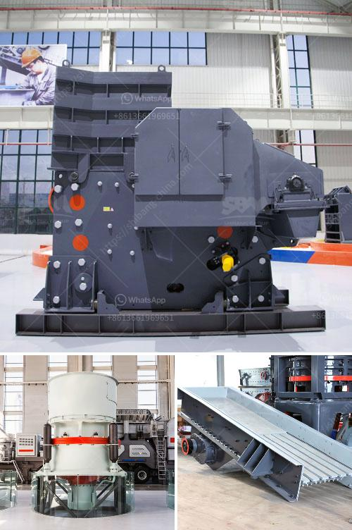

<h3>rock quarry crusher machinery</h3>
Rock quarry crusher machinery includes jaw crusher, impact crusher, cone crusher, etc. The crushing equipment used in rock quarrying operation can vary greatly depending on the type of the stone deposits and the desired final product size. Rock quarrying process involves several stages of crushing, screening, size classification, material handling, and storage operations.

Rock quarrying typically starts by drilling and blasting the rock into smaller pieces. After that, it is loaded onto trucks and transported to the primary crusher. Jaw crusher is often used as the primary crusher in a variety of jaw crusher in rock quarrying applications. It is widely used in various materials processing of mining & construction industries, such as it is suit for crushing granite, marble, basalt, limestone, quartz, cobble, iron ore, copper ore, and some other mineral &rocks.

The rock quarry crusher machinery can be equipped with jaw crusher, impact crusher, cone crusher, vibrating screen and belt conveyor, etc. With different crushing capacities and output sizes, the final product of the rock quarry crusher machinery can be adjust according to the needs of users. Jaw crusher is the most common type of crusher in rock quarry crushers machinery. Jaw crusher is designed to crush rocks due to the action of toggle plate and vertical movement of the swing jaw. Jaw crusher uses two jaws, one fixed and one moving, to break the stone.

Impact crusher is also often used for secondary crushing operations. It can effectively crush materials with compressive strength less than 320 MPa, such as granite, limestone, concrete, etc. The final product is cubic in shape and is widely used in various fields such as highway construction, water conservancy, and construction.

Cone crusher is another important rock quarry crusher machinery used in quarrying operations. Cone crusher is suitable for crushing all kinds of ores and rocks with medium and above medium hardness. It has the advantages of reliable structure, high production efficiency, convenient adjustment, and low operation cost. It is widely used in mining, quarrying, and other industries.

In addition to these primary crushers, there are also other auxiliary equipment used in rock quarrying operations. Vibrating screen is used to separate the oversized stones from the smaller ones. Belt conveyor is used to transport the final product from one location to another. These auxiliary equipment are essential for the smooth operation of the rock quarry crusher machinery.

In conclusion, rock quarry crusher machinery plays an important role in the rock quarrying process. The crushing equipment used in rock quarrying operation can significantly affect the efficiency and production capacity of the quarry. Selecting the right crusher machine for your quarry is vital for achieving desired final product size and throughput. Whether you need a jaw crusher, impact crusher, cone crusher, or any other type of crushing equipment, consult with a qualified supplier to find the best solution for your rock quarrying needs.
<h3>Contact us</h3><ul><li><strong>Whatsapp:&nbsp;<a href="https://wa.me/8613661969651">+8613661969651</a></strong></li><li><a href="https://swt.shibang-china.com/?git&amp;zhl&amp;rock quarry crusher machinery"><strong>Online Service(chat now)</strong></a></li></ul><h3>Related</h3><ul><li><a href='cost of setting up a limestone processing unit.md'>cost of setting up a limestone processing unit</a></li><li><a href='iron ore cruseher plant price.md'>iron ore cruseher plant price</a></li><li><a href='gold processing mill for sale.md'>gold processing mill for sale</a></li><li><a href='turkey of gold refinery project cost.md'>turkey of gold refinery project cost</a></li><li><a href='crusher machine price in nigeria.md'>crusher machine price in nigeria</a></li></ul>