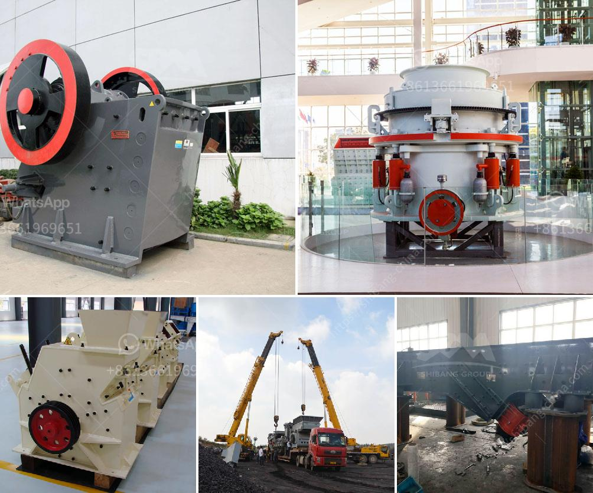

<h3>roll crusher used equipment</h3>
Roll crushers are used in a variety of industries, including mining and construction. The purpose of a roll crusher is to simply crush materials of different sizes and densities. It is commonly used in coal mines for the crushing and screening of coal. The machine relies on a pair of cylindrical rollers that are smooth to ensure a smooth and efficient operation.

One of the main advantages of using roll crushers is their ability to produce a product with a narrow particle size distribution. The product size can be controlled by adjusting the gap between the rolls. This is particularly useful in industries where a specific size of the final product is required.

Another advantage of using roll crushers is their simplicity in operation. They are easy to install and require minimal maintenance. The machine is equipped with a motor, which drives the rolls and a gearbox, which controls the speed of operation. The rolls are driven in opposite directions, ensuring a consistent and even crushing of the material.

Roll crushers also have a high capacity and can process large amounts of material in a single pass. This makes them suitable for applications where a large volume of material needs to be crushed in a short period of time. The machine can be equipped with a feed chute, to ensure a continuous and controlled feed of material into the crushing chamber.

The roll crusher is also versatile and can be used in a variety of applications. It can be used to crush limestone, gypsum, coal, coke, and a variety of other materials. It is commonly used in primary and secondary crushing applications, where the materials are first crushed by a primary crusher and further reduced by a secondary crusher.

When selecting a roll crusher, it is important to consider various factors such as the type of material to be crushed, the required product size, and the capacity of the machine. The size and capacity will determine the size and type of roll crusher required. It is also important to consider the maintenance requirements of the machine and ensure that it is properly maintained to ensure its efficiency and longevity.

In conclusion, roll crushers are a reliable and efficient machine used in various industries for the crushing and screening of materials. They offer advantages such as a narrow particle size distribution, easy operation, and high capacity. When using roll crushers, it is important to consider factors such as the type of material, required product size, and machine capacity. Additionally, proper maintenance of the machine is crucial to ensure its optimal performance.
<h3>Contact us</h3><ul><li><strong>Whatsapp:&nbsp;<a href="https://wa.me/8613661969651">+8613661969651</a></strong></li><li><a href="https://swt.shibang-china.com/?git&amp;zhl&amp;roll crusher used equipment"><strong>Online Service(chat now)</strong></a></li></ul><h3>Related</h3><ul><li><a href='grinding coal mill.md'>grinding coal mill</a></li><li><a href='stone crushing machines in canada.md'>stone crushing machines in canada</a></li><li><a href='list of quarry company in the philippines.md'>list of quarry company in the philippines</a></li><li><a href='large scale gold mining equipment for sale.md'>large scale gold mining equipment for sale</a></li><li><a href='process for chromium separation from chromite ore.md'>process for chromium separation from chromite ore</a></li></ul>