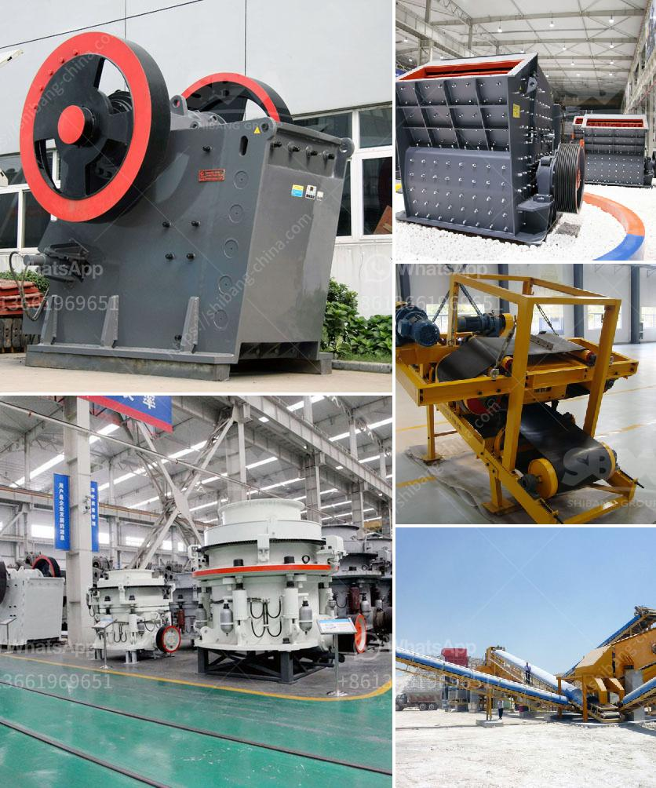

<h3>roll crushers for sale</h3>
Roll crushers are a commonly used piece of equipment for crushing materials. Often used in mining operations, they are designed to reduce large rocks into smaller ones for further processing or to allow for easier transportation. When looking for roll crushers for sale, there are several important factors to consider, including the type of material to be crushed, the desired size of the final product, and the specific requirements of the application.

Roll crushers operate by squeezing the material between two rollers, one moving and one stationary. The two rollers rotate in opposite directions, and the material is pulled between them. This action breaks the material into smaller pieces, which then fall through the gaps between rollers. The size of the final product is determined by the gap between the rollers, which can be adjusted to meet specific requirements.

One of the main advantages of roll crushers is their ability to produce a uniform product size. Unlike jaw crushers, which can produce a variety of product sizes depending on the discharge opening, roll crushers have a specific size control mechanism. By adjusting the gap between the rollers, operators can control the size of the final product, ensuring a consistent and uniform output.

Another advantage of roll crushers is their ability to handle a wide range of materials. From soft to hard materials, and from minerals to industrial by-products, roll crushers can effectively crush a variety of materials. This versatility makes them suitable for various applications, including mining, construction, and recycling.

When considering roll crushers for sale, it is important to choose a model that matches the specific requirements of the application. Factors to consider include the hardness and abrasiveness of the material, the desired size of the final product, and the desired capacity. It is also important to consider the power requirements and the maintenance needs of the equipment.

In addition to these factors, it is also advisable to consider the reputation and reliability of the manufacturer or seller. Look for a reputable supplier that offers high-quality equipment and provides good customer support. Researching online reviews and seeking recommendations from industry professionals can help in finding a reliable seller.

In conclusion, roll crushers are a useful piece of equipment for reducing the size of large rocks and other materials. When looking for roll crushers for sale, it is important to consider factors such as the type of material to be crushed, the desired size of the final product, and the specific requirements of the application. By choosing the right equipment and a reputable seller, operators can ensure efficient and reliable crushing operations.
<h3>Contact us</h3><ul><li><strong>Whatsapp:&nbsp;<a href="https://wa.me/8613661969651">+8613661969651</a></strong></li><li><a href="https://swt.shibang-china.com/?git&amp;zhl&amp;roll crushers for sale"><strong>Online Service(chat now)</strong></a></li></ul><h3>Related</h3><ul><li><a href='mining equipments in japan.md'>mining equipments in japan</a></li><li><a href='calcium carbide making machine used.md'>calcium carbide making machine used</a></li><li><a href='coal pulverizer types.md'>coal pulverizer types</a></li><li><a href='turkey crusher company.md'>turkey crusher company</a></li><li><a href='how to find startup funding for a stone crushing business.md'>how to find startup funding for a stone crushing business</a></li></ul>