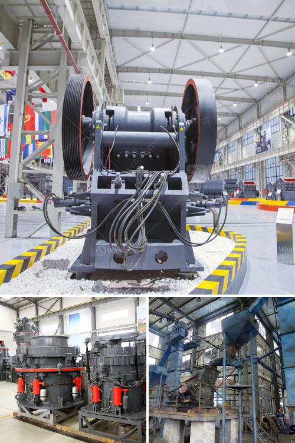

<h3>roller mill advantages</h3>
Roller mills have become a popular choice for processing materials in various industries, including pharmaceutical, food processing, agricultural, and chemical production. This is primarily due to their numerous advantages over other milling options. In this article, we will explore the advantages of roller mills and how they contribute to efficient and effective material processing.

One of the main advantages of roller mills is their ability to grind materials into a uniform particle size distribution. This is crucial in industries such as pharmaceuticals, where precise particle size control is essential for consistent product quality. Roller mills achieve this by utilizing multiple rolls, typically two or more, with different surface profiles. These rolls rotate at different speeds and exert varying degrees of pressure on the material being crushed or ground. As a result, the material is effectively crushed and ground to the desired particle size range.

Another advantage of roller mills is their adaptability to different materials and process requirements. Roller mills can handle a wide range of materials, including grains, minerals, and powders. They can be used to grind, crush, or pulverize materials, depending on the specific application. This versatility allows roller mills to be used in various industries, from grain milling to ore processing.

Roller mills also offer significant energy savings compared to alternative milling methods. The rolling action of the rolls reduces friction and heat generation, resulting in lower energy consumption. This is particularly important in industries where energy costs are a significant expense, such as the food processing and chemical industries. By reducing energy consumption, roller mills contribute to cost savings and environmental sustainability.

Furthermore, roller mills can be designed to accommodate specific process requirements. They can be equipped with various feeding and discharge systems, depending on the material being processed and the desired end product. For example, roller mills can feature gravity or pneumatic grain feeding systems, and various discharge mechanisms such as rotary valves or vibrating screens. These customizable features allow roller mills to be tailored to specific production needs, ensuring optimal performance and productivity.

In addition to their technical advantages, roller mills are also relatively easy to operate and maintain. They have a simple design and require minimal operator intervention once the process parameters have been set. Routine maintenance tasks, such as roll inspections and lubrication, can be easily performed, minimizing downtime and maximizing productivity.

In conclusion, roller mills offer numerous advantages over alternative milling methods. Their ability to achieve a uniform particle size distribution, adaptability to different materials, and energy efficiency make them an attractive choice for many industries. Additionally, their customizable design, ease of operation, and maintenance contribute to their overall appeal. With these advantages, roller mills continue to play a crucial role in material processing across various industries.
<h3>Contact us</h3><ul><li><strong>Whatsapp:&nbsp;<a href="https://wa.me/8613661969651">+8613661969651</a></strong></li><li><a href="https://swt.shibang-china.com/?git&amp;zhl&amp;roller mill advantages"><strong>Online Service(chat now)</strong></a></li></ul><h3>Related</h3><ul><li><a href='alluvial gold processing plant for small scale.md'>alluvial gold processing plant for small scale</a></li><li><a href='mining process for perlite.md'>mining process for perlite</a></li><li><a href='list of quarry company in the philippines.md'>list of quarry company in the philippines</a></li><li><a href='stone crushers for sale south africa second hand.md'>stone crushers for sale south africa second hand</a></li><li><a href='feldspar grinding machine chennai suppliers.md'>feldspar grinding machine chennai suppliers</a></li></ul>