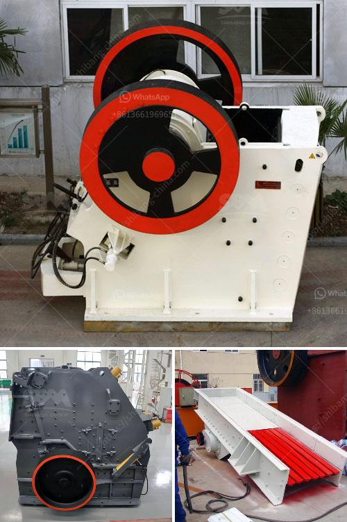

<h3>rollers for stone ball mills</h3>
Stone ball mills are vital equipment used in the production process of various minerals, semi-precious stones, paints, ceramic materials, etc. Traditionally, these mills are composed of a rotating cylinder made of toughened steel or other materials that crush and grind the material into finer particles. However, with advancements in technology and a focus on improving efficiency and performance, rollers have become an integral component in stone ball mills. In this article, we will explore the significance of rollers and how they enhance the overall operation of these mills.

Rollers in stone ball mills play a crucial role in grinding and crushing the material. They are designed to ensure the even distribution of the material inside the mill, enhancing the grinding process and preventing any lumps or unevenness. The presence of rollers generates a continuous crushing effect, resulting in a higher level of particle size reduction. By providing a consistent grinding action, rollers ensure a more efficient and productive milling process.

One of the key benefits of using rollers in stone ball mills is the reduction of wear and tear on the mill itself. With traditional mills, the grinding process often leads to excessive friction and wear on the inner surface of the cylinder, leading to frequent maintenance and repair requirements. However, the use of rollers significantly reduces this issue as the material is evenly distributed, minimizing friction and wear. This results in longer mill life, reduced downtime, and ultimately, lower maintenance costs.

The use of rollers also helps in achieving a more uniform particle size distribution. With traditional mills, there is a tendency for certain areas of the mill to experience higher grinding pressure, resulting in uneven particle sizes. This can negatively impact the quality and consistency of the final product. By incorporating rollers, the grinding pressure is evenly distributed throughout the material, leading to a more uniform particle size distribution and improved product quality.

Furthermore, rollers provide better control over the milling process, allowing for greater precision and accuracy. They enable a more controlled feed rate, ensuring that the material is fed into the mill evenly and efficiently. This helps in maintaining a steady and consistent flow of material, preventing any fluctuations or interruptions that may impact the overall efficiency of the mill.

In conclusion, the integration of rollers in stone ball mills has revolutionized the milling process, enhancing its efficiency, performance, and overall productivity. By promoting an even distribution of the material, reducing wear and tear, achieving a more uniform particle size distribution, and offering better control over the milling process, rollers have become an indispensable component in modern ball mills. Manufacturers and operators alike are increasingly recognizing their importance in maximizing output and achieving high-quality products. As technology continues to advance, we can expect further advancements in roller design and functionality, leading to even more efficient and productive stone ball mills.
<h3>Contact us</h3><ul><li><strong>Whatsapp:&nbsp;<a href="https://wa.me/8613661969651">+8613661969651</a></strong></li><li><a href="https://swt.shibang-china.com/?git&amp;zhl&amp;rollers for stone ball mills"><strong>Online Service(chat now)</strong></a></li></ul><h3>Related</h3><ul><li><a href='stone crusher machine factory in cambodia.md'>stone crusher machine factory in cambodia</a></li><li><a href='cone crusher for sale in uae.md'>cone crusher for sale in uae</a></li><li><a href='stone crushers companies in tanzania.md'>stone crushers companies in tanzania</a></li><li><a href='trackmounted crushing.md'>track-mounted crushing</a></li><li><a href='impact crusher working principle.md'>impact crusher working principle</a></li></ul>