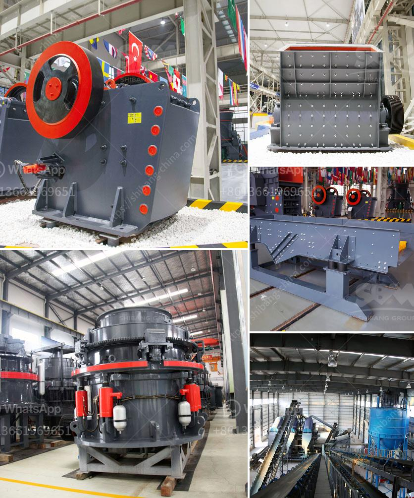

<h3>rotary kiln untuk pengeringan batu kapur kapur</h3>
Limestone is a versatile and widely-used material in various industries. Whether it is used as a raw material for construction, an ingredient in cement production, or in the manufacturing of steel, limestone plays a crucial role. However, before it can be used in these applications, it needs to undergo a drying process to remove moisture and impurities. 

One efficient and popular method for drying limestone is through the use of a rotary kiln. A rotary kiln is a large, rotating cylindrical oven-like structure, which is heated externally. Inside the kiln, limestone is fed at one end while hot gases are introduced at the other end. As the limestone moves through the kiln, it is subjected to high temperatures, causing evaporation of moisture and elimination of impurities.

There are several advantages of using a rotary kiln for limestone drying. Firstly, the continuous rotation of the kiln ensures even distribution of heat, resulting in thorough and uniform drying. This eliminates the risk of certain areas drying faster than others, which can lead to uneven quality. Secondly, the large size of the kiln allows for large quantities of limestone to be dried at once, making it highly efficient for industrial-scale operations.

Furthermore, the kiln can be customized to meet specific drying requirements. The temperature, speed, and angle of the kiln can be adjusted to achieve the desired moisture content and quality of the dried limestone. This flexibility makes the rotary kiln suitable for various industries, where different drying specifications are necessary.

In conclusion, the rotary kiln is an efficient and effective tool for drying limestone. Its continuous rotation and customizable settings allow for thorough and uniform drying, making it ideal for industrial-scale drying operations. With its versatility and ability to cater to different drying requirements, the rotary kiln plays a vital role in the limestone processing industry.
<h3>Contact us</h3><ul><li><strong>Whatsapp:&nbsp;<a href="https://wa.me/8613661969651">+8613661969651</a></strong></li><li><a href="https://swt.shibang-china.com/?git&amp;zhl&amp;rotary kiln untuk pengeringan batu kapur kapur"><strong>Online Service(chat now)</strong></a></li></ul><h3>Related</h3><ul><li><a href='raymond mill manufacturer in india.md'>raymond mill manufacturer in india</a></li><li><a href='hammer mill for sale south africa.md'>hammer mill for sale south africa</a></li><li><a href='impact crusher working principle.md'>impact crusher working principle</a></li><li><a href='quarry equipment prices.md'>quarry equipment prices</a></li><li><a href='sand vsi crusher.md'>sand vsi crusher</a></li></ul>