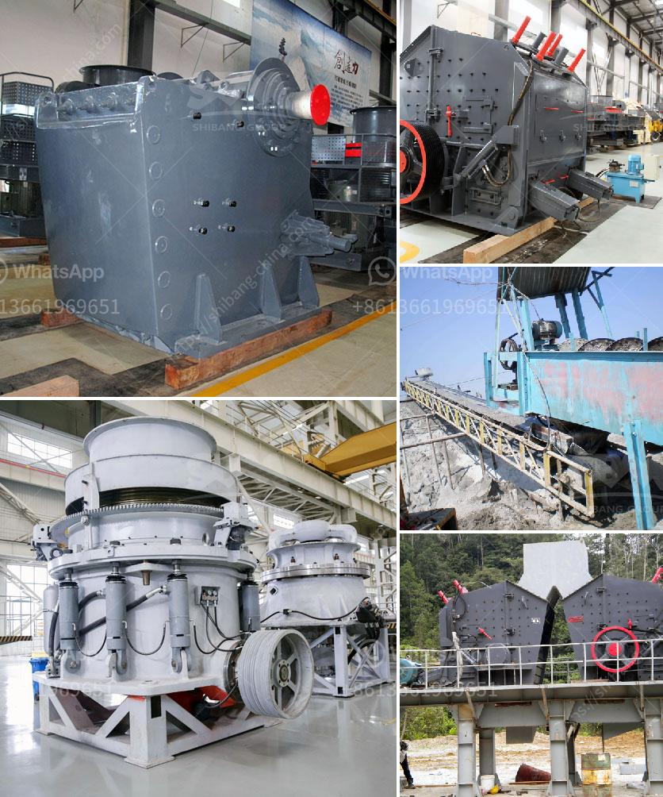

<h3>rotary screen for coal making process</h3>
The coal industry plays a pivotal role in the global energy sector, serving as a primary source for electricity generation and industrial production. As the demand for coal continues to rise, it becomes crucial for coal producers to focus on enhancing efficiency in the coal-making process. One technology that has proven to be effective in this regard is the rotary screen.

A rotary screen, also known as a trommel screen, is a mechanical screening device used to separate materials by size. It consists of a cylindrical drum that is inclined and rotates on its axis. The coal making process involves taking raw coal extracted from mines and preparing it for use by removing impurities and reducing its size to meet specific requirements. The rotary screen plays a vital role in this preparation process.

First and foremost, the rotary screen efficiently separates different sizes of coal. The feedstock is fed into the drum, and as it rotates, the smaller-sized coal particles pass through the screen openings while larger particles are retained. This segregation allows for the production of coal with a consistent particle size, ensuring better combustion performance and improved efficiency in the subsequent stages of coal utilization.

In addition to size separation, the rotary screen also aids in the removal of impurities from coal. Coal extracted from mines often contains rocks, shale, and other extraneous materials that need to be removed. The rotary screen effectively screens out these impurities, preventing them from entering the coal supply chain. This leads to higher-quality coal, reducing the need for additional cleaning processes and improving the overall efficiency of coal utilization.

Furthermore, the rotary screen contributes to the overall sustainability of the coal industry. By removing impurities and reducing coal particle size, the combustion process becomes more efficient and less polluting. It results in reduced emissions of greenhouse gases and other pollutants, thereby minimizing the environmental impact of coal utilization. The efficient screening also ensures minimal waste generation, as the impurities separated from coal can be properly disposed of or even utilized for other purposes.

Another significant advantage of a rotary screen is its versatility and adaptability. It can be easily integrated into existing coal preparation plants, enhancing their efficiency without requiring substantial modifications. The screen's design allows for adjustable inclination angles and varying drum speeds, allowing operators to optimize the screening process for different types of coal and production requirements. This flexibility enables coal producers to adapt to changing market demands, ensuring competitiveness and long-term sustainability.

Overall, the rotary screen is a valuable technology for enhancing the efficiency and sustainability of the coal-making process. By efficiently separating coal particles and removing impurities, it contributes to the production of high-quality coal for various applications. Its versatility and adaptability make it an ideal choice for coal producers looking to optimize their operations and maximize their productivity. As the demand for coal continues to grow, investing in innovative technologies like the rotary screen becomes imperative to meet the energy needs of a rapidly developing world while minimizing the coal industry's environmental impact.
<h3>Contact us</h3><ul><li><strong>Whatsapp:&nbsp;<a href="https://wa.me/8613661969651">+8613661969651</a></strong></li><li><a href="https://swt.shibang-china.com/?git&amp;zhl&amp;rotary screen for coal making process"><strong>Online Service(chat now)</strong></a></li></ul><h3>Related</h3><ul><li><a href='vsi crusher plant.md'>vsi crusher plant</a></li><li><a href='jaw crusher structure.md'>jaw crusher structure</a></li><li><a href='stone crushing machine in china.md'>stone crushing machine in china</a></li><li><a href='ball mill specification.md'>ball mill specification</a></li><li><a href='sand washing plant price.md'>sand washing plant price</a></li></ul>