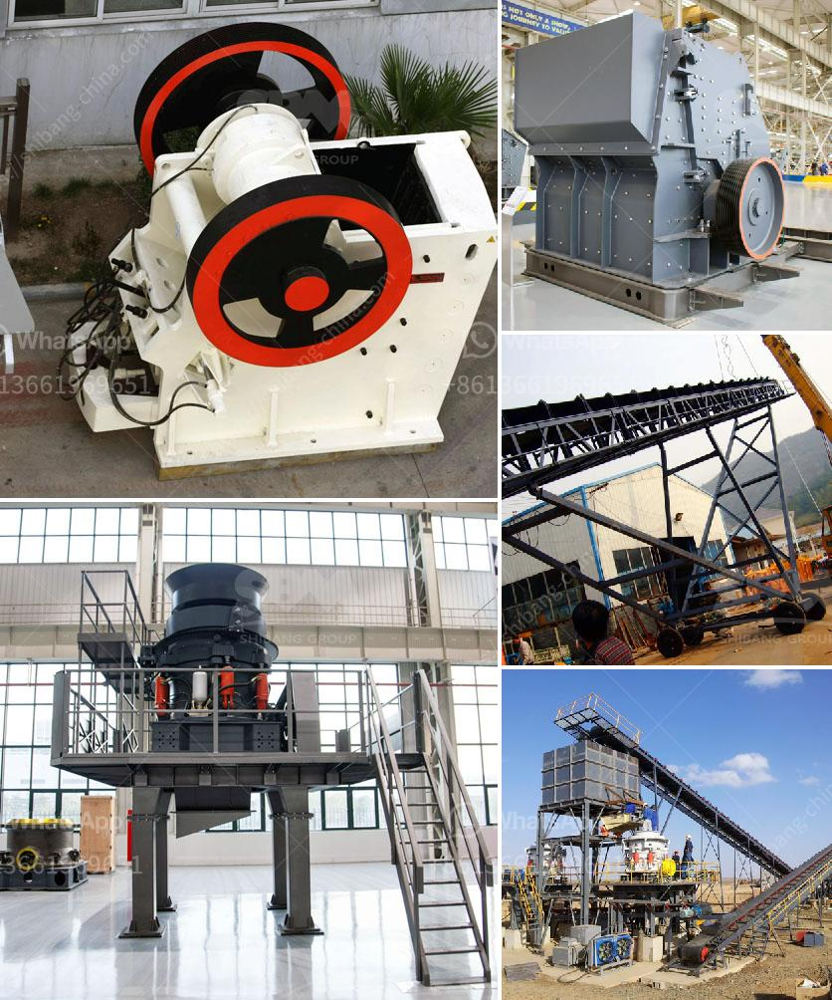

<h3>rotary thermal dryer mining</h3>
Rotary thermal dryers have become a vital component in the mining industry, providing a cost-effective solution for removing moisture from various minerals and ores. This innovative technology offers numerous benefits, making it an indispensable tool for mining companies worldwide.

One of the main advantages of rotary thermal dryers is their ability to efficiently and evenly dry materials. These dryers use hot air to remove moisture, allowing for quicker and more uniform drying compared to other drying methods. This ensures that minerals and ores are dried thoroughly and ready for further processing.

Furthermore, rotary thermal dryers are highly versatile and can accommodate a wide range of materials. Whether it is coal, iron ore, limestone, or other minerals, these dryers can handle various types of feedstock. This flexibility makes rotary thermal dryers ideal for mining operations that deal with different materials on a regular basis.

In addition to their versatility, rotary thermal dryers are also known for their energy efficiency. The drying process is conducted in a closed system, which minimizes heat loss and reduces energy consumption. This not only helps mining companies save on energy costs but also contributes to a more sustainable and environmentally friendly operation.

Moreover, rotary thermal dryers have a compact design, allowing them to be installed in tight spaces, making them suitable for both small-scale and large-scale mining operations. Their sturdy construction ensures durability and long-term performance, even in harsh mining environments.

Overall, rotary thermal dryers have revolutionized the mining industry by providing an efficient and cost-effective solution for drying minerals and ores. With their ability to handle various materials, energy efficiency, and compact design, these dryers have become an essential tool for mining companies looking to optimize their operations and maximize profitability. Whether it is for coal, iron ore, or limestone drying, rotary thermal dryers are the go-to technology for the mining industry.
<h3>Contact us</h3><ul><li><strong>Whatsapp:&nbsp;<a href="https://wa.me/8613661969651">+8613661969651</a></strong></li><li><a href="https://swt.shibang-china.com/?git&amp;zhl&amp;rotary thermal dryer mining"><strong>Online Service(chat now)</strong></a></li></ul><h3>Related</h3><ul><li><a href='sand washing plant price.md'>sand washing plant price</a></li><li><a href='small bleaching powder manufacturing plant project report.md'>small bleaching powder manufacturing plant project report</a></li><li><a href='belt conveyor cost per meter of installation.md'>belt conveyor cost per meter of installation</a></li><li><a href='lime crushing plant components.md'>lime crushing plant components</a></li><li><a href='difference between vsi and sand making machine.md'>difference between vsi and sand making machine</a></li></ul>