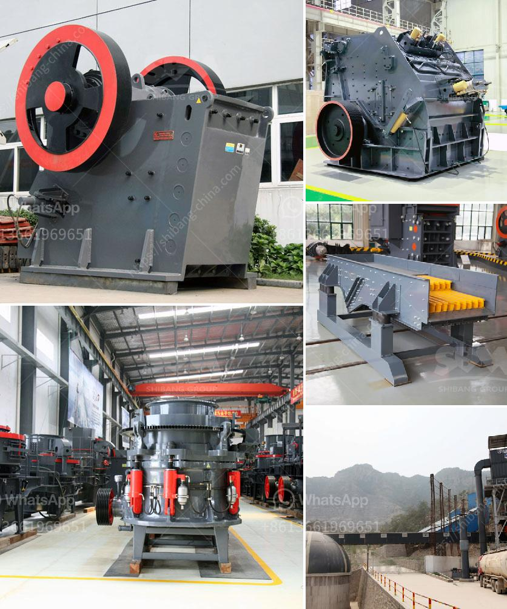

<h3>rotary vacuum paddle dryer india</h3>
Industrial drying is an integral part of various manufacturing processes across different sectors. From pharmaceuticals to chemicals, food processing to textiles, a reliable and efficient drying solution is crucial for ensuring the quality and consistency of the end product. One such cutting-edge drying technology that has gained prominence in the Indian market is the Rotary Vacuum Paddle Dryer.

The Rotary Vacuum Paddle Dryer, commonly abbreviated as RVPD, is a versatile and powerful drying equipment that has revolutionized the Indian industrial drying landscape. It consists of a horizontally rotating vessel with a central shaft and multiple paddle blades that promote rapid and uniform drying. This advanced dryer offers numerous advantages over conventional drying methods, making it an attractive choice for industries seeking efficient and cost-effective drying solutions.

One of the key benefits of the Rotary Vacuum Paddle Dryer is its ability to handle a wide range of materials. Whether it's solids, pastes, cakes, or sludges, the RVPD can effectively dry them all. This feature makes it ideal for industries dealing with diverse raw materials and products, providing them with a versatile and flexible drying solution.

Furthermore, the RVPD ensures efficient drying by creating a vacuum environment inside the vessel. This vacuum helps lower the boiling point of the liquid, resulting in faster evaporation and reduced drying time. The paddle blades, attached to the central shaft, constantly agitate the material, ensuring uniform heat distribution and preventing the formation of lumps or hot spots. This gentle yet effective mixing action minimizes the risk of product degradation, ensuring the quality and integrity of the dried material.

Another notable advantage of the Rotary Vacuum Paddle Dryer is its energy efficiency. The vacuum environment and the efficient mixing action reduce the energy required for drying, resulting in significant cost savings for industries. Moreover, the closed-loop design of the dryer prevents the escape of volatile components, recovering them for further use or disposal. This not only reduces environmental pollution but also enhances the overall efficiency of the drying process.

In India, the Rotary Vacuum Paddle Dryer has gained immense popularity across various industries. Pharmaceutical manufacturers rely on the RVPD to dry active pharmaceutical ingredients (APIs) and improve the stability and shelf life of their products. Chemical industries use this advanced dryer for drying various chemicals, pigments, dyes, and intermediates, ensuring consistent quality and purity. Food processing industries, including spice manufacturers and dried fruit processors, benefit from the RVPD's ability to preserve the natural flavors and colors of their products. The textile industry utilizes the RVPD for drying fabrics, reducing moisture content, and enhancing the durability and quality of their materials.

In conclusion, the Rotary Vacuum Paddle Dryer has revolutionized industrial drying processes in India. Its versatility, efficiency, and energy-saving features have made it a popular choice across various sectors. Whether it's pharmaceuticals, chemicals, food processing, or textiles, the RVPD offers a reliable and cost-effective drying solution. As industries continue to seek enhanced productivity and sustainable practices, the Rotary Vacuum Paddle Dryer is poised to play a crucial role in future industrial drying applications.
<h3>Contact us</h3><ul><li><strong>Whatsapp:&nbsp;<a href="https://wa.me/8613661969651">+8613661969651</a></strong></li><li><a href="https://swt.shibang-china.com/?git&amp;zhl&amp;rotary vacuum paddle dryer india"><strong>Online Service(chat now)</strong></a></li></ul><h3>Related</h3><ul><li><a href='raymond mill crusher price.md'>raymond mill crusher price</a></li><li><a href='crawler mobile jaw crusher for sale.md'>crawler mobile jaw crusher for sale</a></li><li><a href='200 mesh ore grinder cost.md'>200 mesh ore grinder cost</a></li><li><a href='marble crusher china.md'>marble crusher china</a></li><li><a href='cost for the ball mill machines.md'>cost for the ball mill machines</a></li></ul>