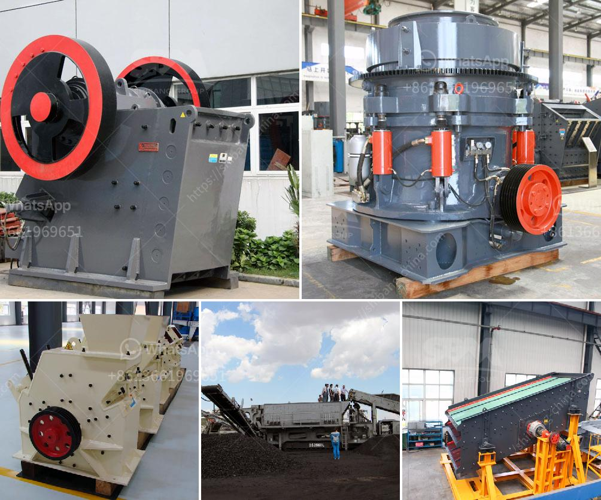

<h3>russia copper ore crushing plant</h3>
Copper ore is widely distributed in Russia, with large reserves and rich resources. In recent years, copper mining has become increasingly important for the country's economy. With the rapid development of mining industry, more and more investors have invested in copper ore crushing plants, realizing the potential profits. In this article, we will introduce the Russia copper ore crushing plant in detail.

The Russia copper ore crushing plant is mainly used for crushing and grinding operations. In principle, the compressive strength of copper ore is relatively low, so it is easy to be broken. Combining the traditional crushing and grinding principles, our copper ore crushing plant adopts cone crusher throughout, providing low operating costs and convenient maintenance.

The copper ore is transported to the vibrating feeder by the dump truck, and the raw materials are evenly fed into the jaw crusher for primary crushing. Then, the primary crushed materials are sent to the cone crusher by belt conveyor for secondary crushing. After that, the materials are sieved by the vibrating screen, and the qualified materials are sent to the finished product area through the belt conveyor. The oversize materials are returned to the cone crusher for further crushing. Finally, the finished copper ore can be transported to the storage yard for subsequent processing.

1. High efficiency: The Russia copper ore crushing plant adopts cone crusher, which has extraordinary performance characteristics, ensuring the finished product has high quality, high yield and low production costs.

2. Convenient operation and maintenance: The Russia copper ore crushing plant is equipped with a hydraulic system, which can effectively reduce the downtime and ensure the safe operation of the equipment.

3. Flexible configuration: The Russia copper ore crushing plant can be customized according to customers' requirements, such as the configuration of the crushing equipment, screening equipment, and transportation equipment, to achieve different production purposes.

In conclusion, the Russia copper ore crushing plant is an ideal crushing equipment for copper ore processing, which provides a great opportunity for the development of copper mining industry. If you want to know more details about our copper ore crushing plant, please feel free to contact us. We are ready to help you achieve success in your mining business.
<h3>Contact us</h3><ul><li><strong>Whatsapp:&nbsp;<a href="https://wa.me/8613661969651">+8613661969651</a></strong></li><li><a href="https://swt.shibang-china.com/?git&amp;zhl&amp;russia copper ore crushing plant"><strong>Online Service(chat now)</strong></a></li></ul><h3>Related</h3><ul><li><a href='manufacturing details of talcum powder.md'>manufacturing details of talcum powder</a></li><li><a href='vertical vertical raw mill.md'>vertical vertical raw mill</a></li><li><a href='quartz powder manufacturing equipments.md'>quartz powder manufacturing equipments</a></li><li><a href='magnesite ore mining process.md'>magnesite ore mining process</a></li><li><a href='lancaster building supply in vryheid.md'>lancaster building supply in vryheid</a></li></ul>