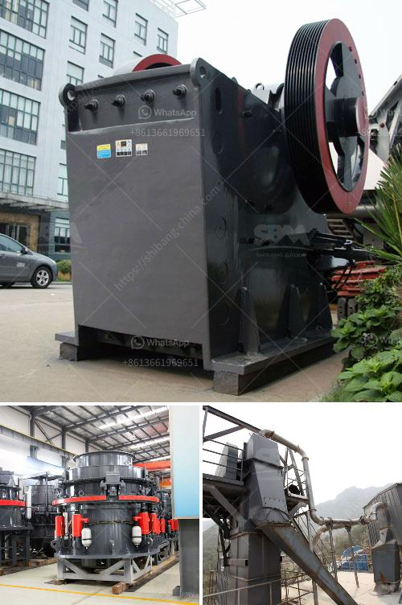

<h3>russia equipment manufacturers mining</h3>
Russia is well-known for its rich natural resources, and the mining industry plays a crucial role in the country's economy. To extract these valuable resources efficiently and effectively, Russia heavily relies on equipment manufacturers that provide cutting-edge technology and machinery for the mining sector. With a long-standing tradition in mining, Russia has fostered a robust manufacturing industry that supplies the necessary equipment to ensure optimal productivity and safety in the mines.

One of the leading equipment manufacturers in Russia's mining sector is Uralmash. With a history spanning over 85 years, Uralmash is known for its heavy machinery production, including crushers, mills, and various types of mining equipment. The company's equipment fulfills international quality standards and is widely used not only within Russia but also exported to other mining-rich regions worldwide.

Another prominent player in Russia's mining equipment manufacturing is Kopeysk Machine-Building Plant (KMBP). Established in 1942, KMBP specializes in the production of mining machinery, including tunneling machinery, conveyor systems, and loaders. KMBP focuses on innovative solutions and constantly strives to meet the ever-evolving needs of the mining industry. Their equipment is highly regarded for its durability, efficiency, and reliability, enabling optimal mining operations.

The Russian company JSC Machine-Building Factory of Podolsk (MZPA) deserves special recognition for its contribution to the mining sector. MZPA specializes in manufacturing crushing and grinding equipment, including mills, crushers, and separators. Combining advanced technologies with a dedicated research and development team, MZPA constantly improves its products to cater to the specific needs of the mining industry, resulting in an increased efficiency and reduced operational costs for mining projects.

Apart from these major players, there are numerous other equipment manufacturers in Russia's mining sector that provide a wide range of machinery and solutions. These manufacturers include OMZ Group, IZ-KARTEX, and Sibbiotech, among others. Each manufacturer brings its own unique expertise and specializations, ensuring a diversified market of mining equipment that meets the diverse needs of different mining operations.

The importance of these equipment manufacturers cannot be overstated. Efficient and reliable mining equipment contributes to increased productivity, better safety measures, and reduced downtime. By utilizing state-of-the-art machinery, mining companies in Russia can extract valuable resources more effectively and maximize their profits.

Furthermore, the development of domestic equipment manufacturers also fosters job creation and economic growth within Russia. These manufacturers employ skilled workers and invest in research and development, promoting technological advancements and innovation within the country.

While Russia's mining equipment manufacturers are highly regarded domestically, they also strive to expand their presence in the international market. With their superior products and competitive pricing, Russian equipment manufacturers are increasingly attracting customers from mining regions across the globe. This not only strengthens Russia's position as a global player in the mining industry but also contributes to the country's export revenue and economic stability.

In conclusion, Russia's equipment manufacturers play a vital role in the mining sector, providing cutting-edge technology and machinery to maximize productivity and safety. Companies like Uralmash, KMBP, and MZPA lead the way in domestic production, with numerous other manufacturers also contributing to the diverse market. The continuous advancement of mining equipment manufacturing in Russia benefits both the country's economy and the global mining industry as a whole.
<h3>Contact us</h3><ul><li><strong>Whatsapp:&nbsp;<a href="https://wa.me/8613661969651">+8613661969651</a></strong></li><li><a href="https://swt.shibang-china.com/?git&amp;zhl&amp;russia equipment manufacturers mining"><strong>Online Service(chat now)</strong></a></li></ul><h3>Related</h3><ul><li><a href='complete mobile stone crushing machine.md'>complete mobile stone crushing machine</a></li><li><a href='silica sand crusher machinery.md'>silica sand crusher machinery</a></li><li><a href='coal crushing plant in pakistan.md'>coal crushing plant in pakistan</a></li><li><a href='how to mine limestone small scale.md'>how to mine limestone small scale</a></li><li><a href='course sand manufacturers in india.md'>course sand manufacturers in india</a></li></ul>