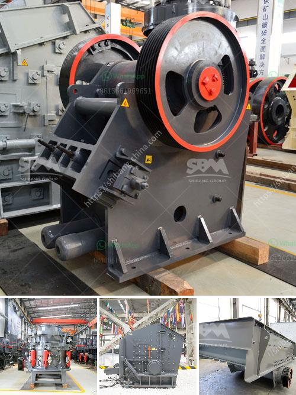

<h3>sahuvala roller mills</h3>
In the world of milling, the name Sahuwala Roller Mills holds a prominent position. With a legacy that spans over seven decades, this renowned company has redefined the milling industry with its top-notch products and customer-centric approach. Sahuwala Roller Mills has become synonymous with quality, reliability, and innovation, making it a preferred choice for businesses in need of roller mills.

Established in 1949, Sahuwala Roller Mills started its journey as a small-scale milling operation in the city of Mathura, India. Over the years, the company grew exponentially, adapting to changing market trends and technology advancements. Today, the organization stands tall as one of the leading manufacturers of roller mills, catering to diverse industries such as food processing, pharmaceuticals, and agricultural produce.

One of the key reasons behind Sahuwala Roller Mills’ success is its unwavering commitment to quality. The company understands that its customers rely on its milling machines for their day-to-day operations, and any compromise in quality can have severe consequences. Therefore, every product manufactured by Sahuwala Roller Mills undergoes rigorous testing and quality checks to ensure they meet the highest industry standards. This dedication to quality has earned the trust and loyalty of customers, making Sahuwala Roller Mills a preferred choice globally.

Another factor that sets Sahuwala Roller Mills apart is its focus on innovation. The company consistently invests in research and development to stay ahead of the curve and meet the evolving needs of customers. The team at Sahuwala Roller Mills combines technological advancements with expertise gained over the years to create cutting-edge, efficient, and reliable roller mills. These machines are designed to deliver optimal performance while minimizing energy consumption and operational costs.

Furthermore, Sahuwala Roller Mills is committed to providing exceptional customer service. The company believes in building long-term partnerships with its customers, understanding their unique requirements, and providing tailored solutions. Sahuwala Roller Mills’ team of dedicated professionals works closely with clients, offering technical support, training, and after-sales service to ensure a seamless experience. This customer-centric approach has helped the company build strong bonds with its clients, turning them into loyal brand advocates.

At Sahuwala Roller Mills, sustainability is not just a buzzword – it is a core value. The company recognizes its responsibility towards the environment and constantly strives to reduce its carbon footprint. Sahuwala Roller Mills has implemented innovative technologies to minimize waste, reduce energy consumption, and ensure responsible water usage. By integrating sustainability into its operations, Sahuwala Roller Mills is contributing to a greener future, while setting a benchmark for responsible industrial practices.

In conclusion, Sahuwala Roller Mills has established itself as a leader in the milling industry, offering high-quality products, innovative solutions, and exceptional customer service. With a legacy spanning over seven decades, the company continues to evolve, adapt, and set new standards. Whether it is the food processing, pharmaceuticals, or agricultural sector, Sahuwala Roller Mills is the go-to partner for businesses seeking reliable and efficient milling solutions. With its unyielding commitment to quality, innovation, and sustainability, Sahuwala Roller Mills is poised to shape the future of the milling industry.
<h3>Contact us</h3><ul><li><strong>Whatsapp:&nbsp;<a href="https://wa.me/8613661969651">+8613661969651</a></strong></li><li><a href="https://swt.shibang-china.com/?git&amp;zhl&amp;sahuvala roller mills"><strong>Online Service(chat now)</strong></a></li></ul><h3>Related</h3><ul><li><a href='gold wash plant for sale in the usa.md'>gold wash plant for sale in the usa</a></li><li><a href='coal mining equipment for sale.md'>coal mining equipment for sale</a></li><li><a href='conveyor belts in coacalco de berriozabal.md'>conveyor belts in coacalco de berriozabal</a></li><li><a href='pulverizer mining crusher 200 mesh.md'>pulverizer mining crusher 200 mesh</a></li><li><a href='lime stone crusher plant.md'>lime stone crusher plant</a></li></ul>