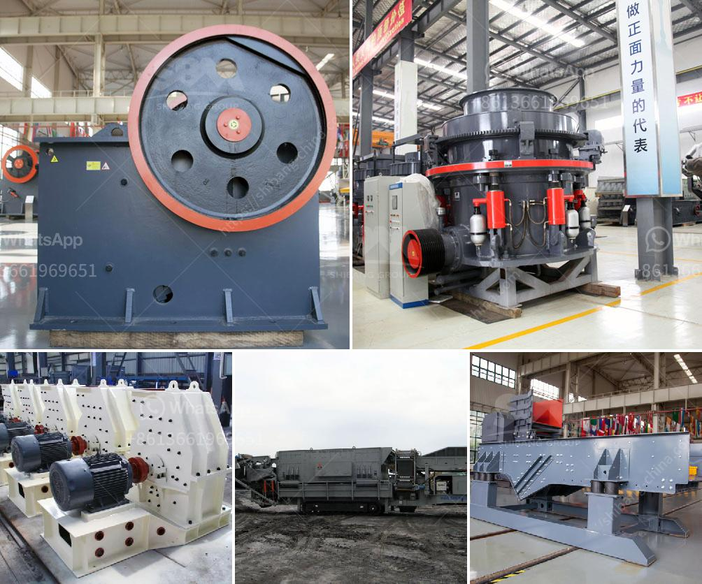

<h3>salary of crusher operer in philippines</h3>
The crusher operator is responsible for operating machinery, crushing materials, and ensuring the effectiveness of the operation. They handle the machines used for crushing various materials like stones, rocks, and ores. The crusher operators are found in industries such as mining, construction, and recycling. In the Philippines, the salary of a crusher operator can vary based on several factors.

One of the significant factors that determine the salary of a crusher operator in the Philippines is their experience. Generally, those who are new to the field may start with a lower salary compared to those with years of experience. As they gain more experience and become more proficient in their work, their salary can increase gradually. For instance, a crusher operator with less than five years of experience might earn an average monthly salary of around 15,000 to 20,000 Philippine pesos (PHP). However, those with more than five years of experience can expect a monthly salary ranging from 20,000 to 30,000 PHP.

Moreover, the location of the job can also affect the salary of a crusher operator. In metropolitan areas like Manila and Cebu, the cost of living is generally higher compared to rural areas. As a result, the salaries in these urban areas may be slightly higher to compensate for the higher living expenses. In provincial areas, the salaries might be slightly lower, but this can vary depending on the demand for crusher operators in the area. The salary can also be influenced by the industry and company size. For example, large mining companies may offer higher salaries compared to smaller construction firms.

Furthermore, the level of education and skills of a crusher operator can impact their salary. Those with formal training in heavy equipment operation and relevant certifications might command a higher salary. Additionally, having additional skills such as welding, maintenance, or repair can also increase their salary. Companies value employees who have a broader skill set as they can contribute to various tasks and reduce the need for hiring additional personnel.

It is important to note that the salary of a crusher operator is not limited to the base pay. Other benefits and allowances may be provided, especially in larger companies. These benefits may include health insurance, paid leaves, retirement plans, and bonuses. The amount and availability of such benefits may vary depending on the company's policies and the terms of the employment contract.

In conclusion, the salary of a crusher operator in the Philippines can vary based on factors such as experience, location, industry, and skills. While the average monthly salary for a beginner might range from 15,000 to 20,000 PHP, more experienced crusher operators can earn anywhere from 20,000 to 30,000 PHP. The location and company size can also influence the salary. Additionally, possessing relevant certifications and additional skills can further increase the earning potential of a crusher operator.
<h3>Contact us</h3><ul><li><strong>Whatsapp:&nbsp;<a href="https://wa.me/8613661969651">+8613661969651</a></strong></li><li><a href="https://swt.shibang-china.com/?git&amp;zhl&amp;salary of crusher operer in philippines"><strong>Online Service(chat now)</strong></a></li></ul><h3>Related</h3><ul><li><a href='sand making crusher machine.md'>sand making crusher machine</a></li><li><a href='process of cement production.md'>process of cement production</a></li><li><a href='price of grinding mills in kenya.md'>price of grinding mills in kenya</a></li><li><a href='cost of feldsper processing machine.md'>cost of feldsper processing machine</a></li><li><a href='coal mill manufacturer china.md'>coal mill manufacturer china</a></li></ul>