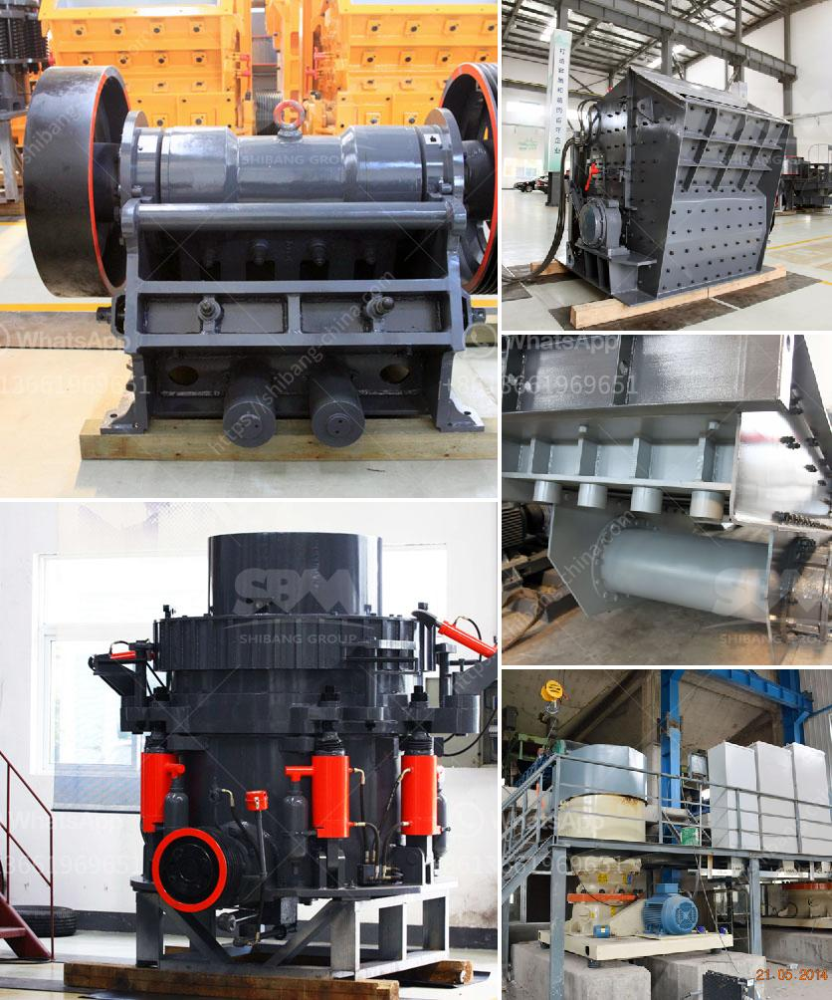

<h3>sale of crushers in malaysia</h3>
Malaysia, known for its rapid urbanization and growing infrastructure, has emerged as a hub for the construction industry. With the country's focus on expanding its transport networks, building commercial establishments, and developing residential projects, the demand for high-quality crushers has skyrocketed. The sale of crushers in Malaysia is witnessing a significant surge, catering to the ever-increasing construction needs of the nation.

Malaysia's construction sector is experiencing remarkable growth, driven by ambitious government infrastructure projects, private investments, and the country's overall economic development. Over the past few years, Malaysia has witnessed an upsurge in the construction of highways, bridges, railways, airports, and manufacturing plants, among others. Such development projects require a substantial quantity of aggregates, rocks, and minerals, leading to an increased demand for crushers.

Crushers play a pivotal role in the construction industry by breaking down large rocks and minerals into smaller, manageable sizes. These smaller-sized materials serve as the primary raw materials for the production of concrete, asphalt, and other construction materials. Crushers are extensively used in road construction, building construction, mining, and quarrying activities. With the rising demand for infrastructure development, the market for crushers in Malaysia has witnessed a significant surge.

The sale of crushers in Malaysia has been bolstered by technological advancements in the industry. Today, modern crushers are equipped with advanced features, such as precise automation, remote control operation, and enhanced performance efficiency. Manufacturers are focused on improving the equipment's energy efficiency, reducing emissions, and ensuring compliance with environmental regulations. These advancements have enhanced the overall appeal of crushers, attracting buyers who prioritize environmental sustainability.

Major crusher manufacturers from around the world have recognized the lucrative market opportunity in Malaysia and established their presence in the country. Renowned global brands have set up production facilities or established partnerships with local entities to cater to the growing demand. Simultaneously, local manufacturers have also emerged, leveraging their understanding of the local market dynamics and customer preferences. This competition results in a diverse range of crushers available in Malaysia, offering buyers the freedom to choose from multiple options.

The Malaysian government has recognized the importance of the construction industry in the nation's economic growth. To support this sector further, the government has introduced various initiatives and incentives, such as tax breaks, subsidies, and flexible financing options. These measures are encouraging construction companies to invest in modern equipment, including crushers, to enhance their productivity and competitiveness.

The growing construction industry in Malaysia, combined with technological advancements, increasing environmental awareness, and government support, has fueled the sale of crushers. The demand for crushers is likely to continue to rise as ambitious infrastructure projects and urbanization initiatives take shape. The availability of a wide range of crushers allows buyers to choose equipment that suits their specific project requirements. Malaysian construction firms, therefore, have a wide array of choices to ensure efficient and sustainable construction practices.
<h3>Contact us</h3><ul><li><strong>Whatsapp:&nbsp;<a href="https://wa.me/8613661969651">+8613661969651</a></strong></li><li><a href="https://swt.shibang-china.com/?git&amp;zhl&amp;sale of crushers in malaysia"><strong>Online Service(chat now)</strong></a></li></ul><h3>Related</h3><ul><li><a href='typical 100tph jaw crusher feed size.md'>typical 100tph jaw crusher feed size</a></li><li><a href='big crushing machine.md'>big crushing machine</a></li><li><a href='production of calcium carbonate from limestone.md'>production of calcium carbonate from limestone</a></li><li><a href='basalt production machinery.md'>basalt production machinery</a></li><li><a href='cone crusher middle east.md'>cone crusher middle east</a></li></ul>