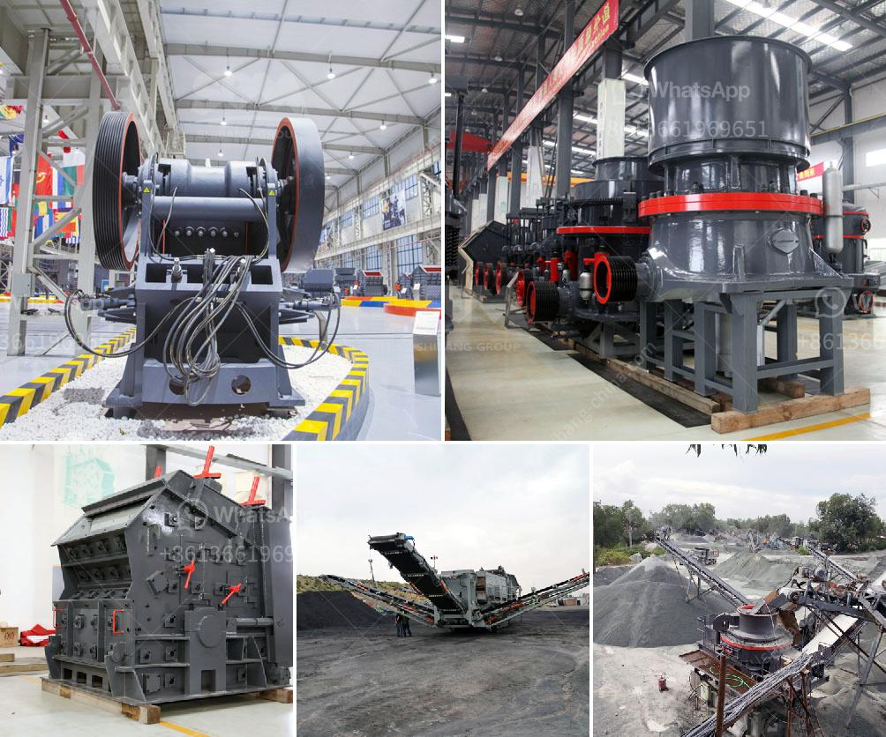

<h3>samp hammer mill china</h3>
The Samp Hammer Mill China is a revolutionary piece of equipment that is designed to enhance the milling process for various industries. This advanced machinery is manufactured in China and has gained popularity due to its exceptional performance and quality.

The Samp Hammer Mill China is specifically designed to mill various grains such as corn, wheat, and barley. It operates by using hammers to grind the grains into finer particles, which are then collected and used for various purposes. The machine's design ensures efficiency, precision, and reliability in the milling process.

One of the key features of the Samp Hammer Mill China is its ability to adjust the particle size of the milled grains. This flexibility allows users to produce different grades of flour or meal, depending on their specific requirements. Whether it's coarse or fine grinds, this machine can deliver consistent results, ensuring high-quality outputs.

Another notable feature of the Samp Hammer Mill China is its durability. Made from high-quality materials and designed for heavy-duty operations, this equipment can withstand rigorous milling processes. Its robust construction ensures high resistance to wear and tear, thus extending its lifespan and reducing maintenance costs.

Furthermore, the Samp Hammer Mill China is equipped with safety features to protect both the user and the machine. These safety mechanisms are designed to prevent accidents during operation, ensuring a safer working environment. Users can have peace of mind knowing that their employees are protected while operating this equipment.

The Samp Hammer Mill China also boasts of energy efficiency. Its motor operates with minimal energy consumption, enabling businesses to save on energy costs. This makes it an attractive investment for companies looking to optimize their expenses while maintaining high productivity levels.

Additionally, the Samp Hammer Mill China can be customized to meet specific requirements. Manufacturers can tailor the machine's specifications, such as its capacity and power output, to suit their particular needs. This level of customization allows businesses to maximize their operational efficiency and cater to their customers' demands.

Despite being manufactured in China, the Samp Hammer Mill has gained recognition worldwide due to its impressive performance. Its use is not limited to China; it is utilized by industries worldwide that require efficient and reliable milling processes. From small-scale mills to large industrial factories, this equipment has proven its worth in various applications.

In conclusion, the Samp Hammer Mill China has revolutionized the milling process with its innovative design and exceptional performance. Businesses that invest in this equipment can expect improved efficiency, enhanced productivity, and reduced costs in their milling operations. With its durability, safety features, energy efficiency, and customization options, the Samp Hammer Mill China is an ideal choice for industries seeking high-quality milling solutions.
<h3>Contact us</h3><ul><li><strong>Whatsapp:&nbsp;<a href="https://wa.me/8613661969651">+8613661969651</a></strong></li><li><a href="https://swt.shibang-china.com/?git&amp;zhl&amp;samp hammer mill china"><strong>Online Service(chat now)</strong></a></li></ul><h3>Related</h3><ul><li><a href='portable crushing machine from spain.md'>portable crushing machine from spain</a></li><li><a href='used limestone milling machine.md'>used limestone milling machine</a></li><li><a href='trading industrial stone crushers.md'>trading industrial stone crushers</a></li><li><a href='turkish manufacturer belt conveyor.md'>turkish manufacturer belt conveyor</a></li><li><a href='plant of quartz poweder is salling out.md'>plant of quartz poweder is salling out</a></li></ul>