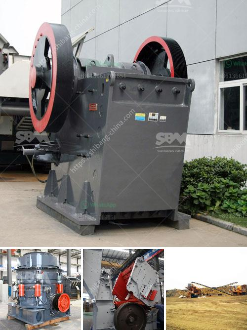

<h3>sample mining project proposal</h3>
Mining has been a cornerstone of human civilization for centuries, providing invaluable resources that fuel economic growth. However, traditional mining techniques are often associated with significant environmental consequences and limited resources. In recent years, the concept of sample mining has emerged as an innovative approach to address these challenges. This article presents a project proposal for sample mining, outlining its benefits, potential areas of exploration, and the necessary steps for its successful implementation.

Sample mining refers to the process of extracting and analyzing small-scale samples to determine their economic viability before committing to full-scale mining operations. This approach offers numerous benefits, such as reduced environmental impact, decreased financial risks, and the ability to identify previously undiscovered mineral deposits. By limiting excavation to smaller areas, sample mining allows for targeted exploration while minimizing disturbance to surrounding ecosystems.

1. Remote and unexplored regions: Regions that have yet to be extensively explored due to geographical challenges, lack of infrastructure, or limited data can benefit greatly from sample mining projects. These areas often hold untapped mineral resources that can contribute to economic development while preserving sensitive ecosystems.

2. Abandoned mine sites: Repurposing abandoned mines through sample mining presents an opportunity to utilize existing infrastructure and recover valuable resources. Rather than leaving these sites in disuse, sample mining enables the detection of remaining deposits and potential rehabilitation of the area.

3. Oceans and deep-sea mining: With the advancement of technology, sample mining has expanded beyond terrestrial exploration. Deep-sea mining projects can offer access to critical minerals, such as cobalt and nickel, which are essential for renewable energy technologies. Sample mining can help assess the feasibility and environmental impacts of extracting these resources from the ocean floor.

1. Comprehensive research and data analysis: As with any mining project, thorough preliminary research and data analysis are crucial. This includes identifying prospective regions, evaluating the geological and environmental conditions, and studying the economic feasibility of potential mining operations.

2. Stakeholder engagement and environmental impact assessment: Engaging with local communities, indigenous groups, and environmental organizations is vital for achieving a sustainable sample mining project. Environmental impact assessments should be conducted to identify potential risks and develop mitigation strategies.

3. Application of advanced exploration techniques: Sample mining projects rely on cutting-edge exploration technologies, such as remote sensing, aerial surveys, and geochemical analysis. These techniques determine the presence and concentration of minerals within the sampled area, enabling efficient decision-making for further development.

4. Monitoring and adaptive management: Continuous monitoring of sample mining operations is crucial for minimizing environmental impact and ensuring sustainable practices. Adaptive management strategies allow for adjustments based on new data and insights, maximizing the efficiency and effectiveness of the project.

Sample mining presents a innovative approach to traditional mining, offering a path towards sustainable resource extraction while minimizing environmental harm. This proposed project focuses on areas ripe for exploration and outlines the necessary steps for its successful implementation. Harnessing the potential of sample mining will not only unlock hidden treasures but also contribute to a greener and more responsible mining industry.
<h3>Contact us</h3><ul><li><strong>Whatsapp:&nbsp;<a href="https://wa.me/8613661969651">+8613661969651</a></strong></li><li><a href="https://swt.shibang-china.com/?git&amp;zhl&amp;sample mining project proposal"><strong>Online Service(chat now)</strong></a></li></ul><h3>Related</h3><ul><li><a href='rollers for stone ball mills.md'>rollers for stone ball mills</a></li><li><a href='coal mining equipment for sale.md'>coal mining equipment for sale</a></li><li><a href='canadian gold mining equipment manufacturers.md'>canadian gold mining equipment manufacturers</a></li><li><a href='difference between vsi and sand making machine.md'>difference between vsi and sand making machine</a></li><li><a href='dry processing machine supplier.md'>dry processing machine supplier</a></li></ul>