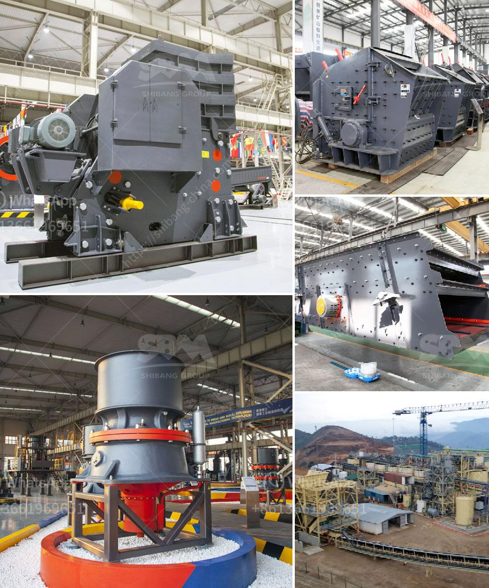

<h3>sand and gravel separation machine</h3>
Sand and gravel are common raw materials in construction projects, such as roads, bridges, buildings, and railways. To acquire high-quality sand and gravel, extensive and careful processing is necessary. One essential piece of equipment that ensures efficient separation and sorting of sand and gravel is a sand and gravel separation machine.

A sand and gravel separation machine helps in separating the different components of sand and gravel using gravity, vibration, and water. These machines offer numerous advantages, including efficient sorting, high productivity, and low operational costs. They are particularly useful in mining operations, where large amounts of sand and gravel need to be processed quickly.

The separation process starts with feeding the mixture of sand and gravel into the machine's hopper. The machine then uses a vibrating screen to separate the larger particles of gravel from the smaller particles of sand. The separated gravel can be further processed or used immediately, while the sand can be further refined to remove impurities.

Some sand and gravel separation machines use water to help remove impurities. A waterjet nozzle can spray water onto the sand and gravel mixture, causing the lighter sand particles to float and separate from the heavier gravel particles. The water also helps in washing away any dirt or other contaminants present in the mixture.

The separated sand and gravel can be collected in different containers or conveyor belts for further processing or transportation. This process ensures that high-quality sand and gravel are obtained, which are essential for constructing durable and long-lasting infrastructure.

Sand and gravel separation machines come in various sizes and configurations to suit different needs. Some machines are portable, allowing them to be easily moved to different sites, while others are stationary and designed for large-scale operations. Advanced technologies and automation features have significantly improved the efficiency and accuracy of these machines, reducing the need for manual labor and enhancing productivity.

In conclusion, sand and gravel separation machines play a vital role in the construction industry by efficiently separating and sorting sand and gravel, resulting in high-quality materials for various construction projects. These machines offer numerous benefits, including high productivity, low operation costs, and accurate separation. With the continuous advancement in technology, we can expect further improvements in sand and gravel separation machines, making them even more efficient and reliable.
<h3>Contact us</h3><ul><li><strong>Whatsapp:&nbsp;<a href="https://wa.me/8613661969651">+8613661969651</a></strong></li><li><a href="https://swt.shibang-china.com/?git&amp;zhl&amp;sand and gravel separation machine"><strong>Online Service(chat now)</strong></a></li></ul><h3>Related</h3><ul><li><a href='antimony processing plant design.md'>antimony processing plant design</a></li><li><a href='crusher machine to make crushed sand from mm.md'>crusher machine to make crushed sand from mm</a></li><li><a href='types of diaphragm in ball mill.md'>types of diaphragm in ball mill</a></li><li><a href='used crushers in america.md'>used crushers in america</a></li><li><a href='stone crusher machine in peru.md'>stone crusher machine in peru</a></li></ul>