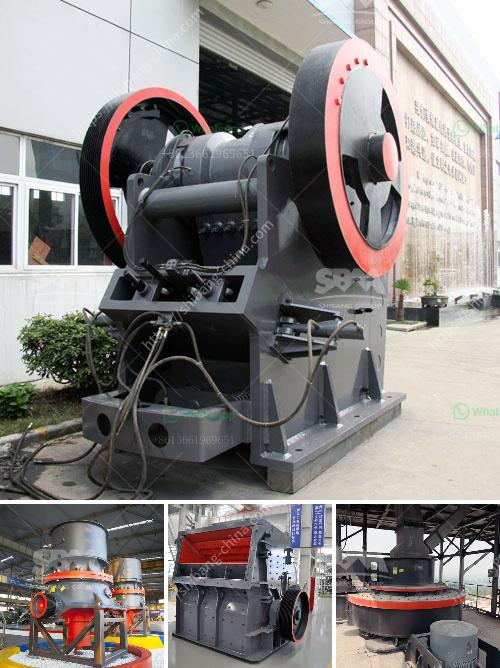

<h3>sand and quarry importer in singapore</h3>
Singapore is a small island state that has undergone rapid urbanization and infrastructural development over the past few decades. With limited land resources, the process of land reclamation has become crucial in meeting the growing needs of the city-state. As a result, the demand for sand and quarry imports in Singapore has skyrocketed, leading to the emergence of a thriving industry.

Sand is a critical component in the construction industry, serving as a primary raw material for concrete and mortar production. It is used in various construction activities, including land reclamation, building foundations, and roads. In Singapore, where land is scarce, sand plays an even more vital role in the nation's development.

Quarrying is the process of extracting large rocks or stones from the earth's surface. These rocks are then crushed into smaller, more manageable sizes for use in construction projects. Singapore relies heavily on importing quarried materials, as its own supply is limited. The importation of rocks and stones is essential to sustain the city-state's construction activities and support its growth agenda.

The process of importing sand and quarry materials into Singapore is not without challenges. With increasing global demand and stricter regulations on sand extraction, finding reliable suppliers can be a complex task. Importers must navigate issues such as environmental sustainability, ethical sourcing, and compliance with international guidelines, ensuring that the imported materials do not harm the environment or violate human rights.

In recent years, Singapore has taken significant steps towards sustainable development, including the adoption of environmentally-friendly practices in the construction industry. The city-state has been actively exploring alternative sources of sand, such as the use of recycled materials and exploring offshore sand banks. These initiatives aim to reduce Singapore's dependency on imported resources and minimize the ecological impact of construction activities.

As Singapore continues to develop and expand, the demand for sand and quarry imports will remain high. The industry plays a vital role in supporting the nation's growth agenda and meeting construction needs. However, it is crucial to balance economic development with sustainable practices, ensuring responsible sourcing of materials and minimizing environmental impact. This will ensure a bright and sustainable future for Singapore's construction industry while preserving the country's natural resources.
<h3>Contact us</h3><ul><li><strong>Whatsapp:&nbsp;<a href="https://wa.me/8613661969651">+8613661969651</a></strong></li><li><a href="https://swt.shibang-china.com/?git&amp;zhl&amp;sand and quarry importer in singapore"><strong>Online Service(chat now)</strong></a></li></ul><h3>Related</h3><ul><li><a href='rotary kiln untuk pengeringan batu kapur kapur.md'>rotary kiln untuk pengeringan batu kapur kapur</a></li><li><a href='high energy ball mill india.md'>high energy ball mill india</a></li><li><a href='large scale gold mining equipment for sale.md'>large scale gold mining equipment for sale</a></li><li><a href='industrial vibrator feeders.md'>industrial vibrator feeders</a></li><li><a href='aggregate crusher for sale in philippines.md'>aggregate crusher for sale in philippines</a></li></ul>