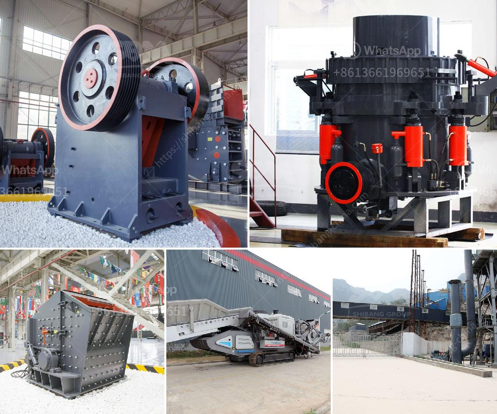

<h3>sand crusher for sale</h3>
Sand crushers are machines that break down the larger rocks and stones into smaller pieces to produce sand. They are widely used in construction projects as it saves time, labor, and cost by reducing the size of the raw materials. Moreover, sand crushers ensure the quality of the final product by producing sand that is consistent in size and texture.

If you are considering purchasing a sand crusher, there are various factors to take into account. One of the primary considerations is the capacity of the machine, which determines the amount of sand it can produce within a specific timeframe. If you have a large construction project, you may need a crusher with a higher capacity to meet the demand.

Additionally, it is essential to consider the level of automation and ease of use. Some sand crushers come with advanced features like automatic control systems, which optimize the production process, reduce human intervention, and minimize the chances of error. Such features can greatly enhance productivity and efficiency.

Moreover, it is crucial to choose a sand crusher that is durable and requires minimal maintenance. This ensures that the machine can withstand heavy usage and continue to perform optimally for an extended period. Look for crushers made from high-quality materials like steel, as they tend to be more durable and resistant to wear and tear.

When searching for a sand crusher for sale, it is advisable to explore various options. Online marketplaces and equipment dealers offer a wide range of crushers to choose from, allowing you to compare prices, features, and specifications. Additionally, do not hesitate to seek advice from experts and professionals in the field who can guide you towards the best-suited machine for your specific needs.

In conclusion, purchasing a sand crusher can greatly benefit your construction projects. Carefully consider factors such as capacity, automation, durability, and ease of use when choosing a suitable crusher. By investing in a high-quality and efficient sand crusher, you can ensure the production of consistent, fine sand that meets the requirements of your projects.
<h3>Contact us</h3><ul><li><strong>Whatsapp:&nbsp;<a href="https://wa.me/8613661969651">+8613661969651</a></strong></li><li><a href="https://swt.shibang-china.com/?git&amp;zhl&amp;sand crusher for sale"><strong>Online Service(chat now)</strong></a></li></ul><h3>Related</h3><ul><li><a href='crusher plant quarry philippines.md'>crusher plant quarry philippines</a></li><li><a href='brick making machines for sale in zimbabwe.md'>brick making machines for sale in zimbabwe</a></li><li><a href='sand washing machine lsx920.md'>sand washing machine lsx920</a></li><li><a href='aggregates crushing flow chart process.md'>aggregates crushing flow chart process</a></li><li><a href='quarry rock crusher.md'>quarry rock crusher</a></li></ul>