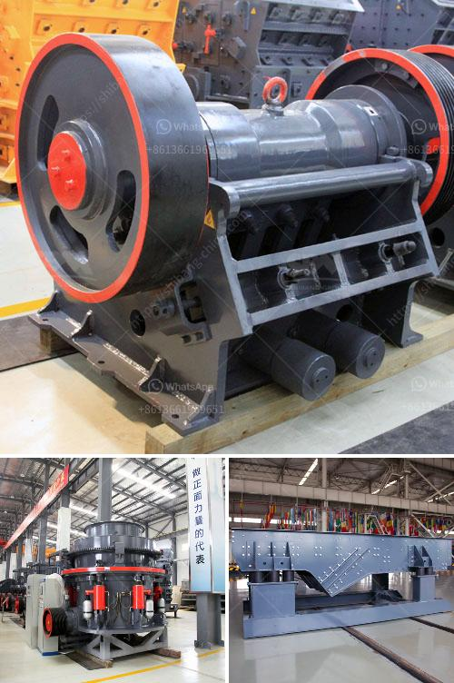

<h3>sand crusher machine price at india</h3>
Sand crusher machine price in India, as the name suggests, is used for crushing stones and rocks during the processing of aggregate materials. These machines have many competitive advantages over traditional crusher machines. It provides an efficient and environmentally friendly solution for sand industry. It is widely used in construction sites, highways and railways, and can be used for crushing various ores, such as limestone, granite and basalt.

The sand crusher machine price in India is widely used for crushing hard and brittle materials, such as rock, grinding material, refractory material, cement clinker, quartzite, iron ore, concrete aggregate, etc. It is especially suitable for the sand and aggregate making for construction and road paving.

There are many sand crusher machines manufacturers in India, but the prices of these machines are relatively high due to the high costs of transportation, installation, maintenance, and replacement parts. As a result, a lot of customers have been put off by the high price of sand crusher machines.

However, with the rapid development of infrastructure projects in India, the demand for sand and aggregate is increasing day by day, which has driven the rapid development of the sand crusher machine industry. Therefore, in order to meet the needs of various customers and improve market competitiveness, many sand crusher machine manufacturers have introduced low-costsand crusher machines in India. 

These low-cost machines not only have competitive prices, but also have excellent performance, high efficiency and low energy consumption. They are equipped with advanced technology and are easy to operate, which greatly reduces the operating costs of customers. In addition, these machines are also environmentally friendly and energy-saving, which can effectively reduce carbon emissions and protect the environment.

The sand crusher machine price in India has the characteristics of reliable performance, reasonable design, convenient operation and high working efficiency. It is widely used in the current market and can be used for the sand production of hard limestone, granite, basalt, river pebble and other materials. If you want to know more about the sand crusher machine price in India, you can visit the official website of sand crusher machine manufacturers or contact their customer service staff to inquire.
<h3>Contact us</h3><ul><li><strong>Whatsapp:&nbsp;<a href="https://wa.me/8613661969651">+8613661969651</a></strong></li><li><a href="https://swt.shibang-china.com/?git&amp;zhl&amp;sand crusher machine price at india"><strong>Online Service(chat now)</strong></a></li></ul><h3>Related</h3><ul><li><a href='cement mill plants.md'>cement mill plants</a></li><li><a href='gypsum recycling equipment for sale.md'>gypsum recycling equipment for sale</a></li><li><a href='small scale gypsum powder plant.md'>small scale gypsum powder plant</a></li><li><a href='industrial vibrator feeders.md'>industrial vibrator feeders</a></li><li><a href='grinding mill manufacturer in italy.md'>grinding mill manufacturer in italy</a></li></ul>