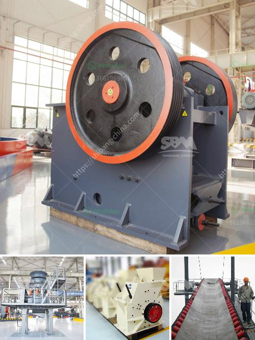

<h3>sand dryer for sale in zimbabwe</h3>
Zimbabwe, a landlocked country located in southern Africa, is renowned for its diverse landscapes, rich mineral resources, and thriving agricultural industry. With its vast agricultural lands and thriving mining sector, the need for efficient and sustainable drying solutions has become crucial. Enter the sand dryer – a powerful and versatile machine that ensures quick and effective drying of a wide range of materials, including sand, grains, minerals, and more.

A sand dryer is a specialized piece of equipment designed to remove moisture content from sand particles, resulting in a dry and consistent product. It offers numerous advantages, making it an essential tool for various industries in Zimbabwe.

First and foremost, a sand dryer helps enhance productivity. In agriculture, drying sand helps remove excess moisture, allowing for better soil aeration and preventing waterlogging. This can significantly improve crop yields and minimize the risk of diseases caused by damp soil conditions. Moreover, in the construction industry, dry sand is a fundamental component of concrete production. Efficient drying ensures a higher quality product, reduces drying time, and boosts construction efficiency.

Secondly, a sand dryer offers substantial energy savings. Traditional drying methods, such as sun-drying or open-air drying, often require extended periods and significant space. This not only increases labor costs but also results in higher energy consumption due to prolonged exposure. In contrast, a sand dryer utilizes advanced technology to streamline the drying process, significantly reducing energy consumption and overall operational costs. Its energy-efficient design saves both time and money while minimizing environmental impact.

Additionally, a sand dryer provides superior quality control. Zimbabwe's mining sector relies heavily on the extraction and processing of minerals, such as gold, platinum, and chrome. These minerals often require drying to reach the desired moisture content before further processing. A sand dryer ensures consistent and precise drying, eliminating the risk of over-drying or under-drying, which can result in product degradation or moisture-related issues during transportation and storage. By maintaining optimal moisture levels, businesses can meet quality standards and deliver a superior final product to their customers.

Considering the numerous benefits and increasing demand for sand dryers in Zimbabwe, it's essential to find a reliable supplier offering high-quality and cost-effective solutions. A reputable supplier will provide a wide range of sand dryers tailored to meet specific requirements, considering factors such as required drying capacity, energy efficiency, and automation options.

Moreover, in today's era of sustainable development, it is crucial to choose a sand dryer that aligns with eco-friendly practices. Opting for a machine that incorporates energy-saving features, utilizes renewable energy sources, or minimizes waste and emissions will not only contribute to the preservation of Zimbabwe's natural resources but also enhance the reputation and competitiveness of local businesses.

In conclusion, the availability of sand dryers for sale in Zimbabwe presents an opportunity for various industries to optimize their drying processes, improve productivity, and reduce costs. Investing in a high-quality sand dryer offers the efficiency, reliability, and sustainability required for the agriculture and mining sectors. By embracing modern drying solutions, Zimbabwe can enhance its position in the global market and boost its economic growth while paving the way for a more sustainable future.
<h3>Contact us</h3><ul><li><strong>Whatsapp:&nbsp;<a href="https://wa.me/8613661969651">+8613661969651</a></strong></li><li><a href="https://swt.shibang-china.com/?git&amp;zhl&amp;sand dryer for sale in zimbabwe"><strong>Online Service(chat now)</strong></a></li></ul><h3>Related</h3><ul><li><a href='mobile iron ore impact crusher suppliers in india.md'>mobile iron ore impact crusher suppliers in india</a></li><li><a href='gold mining machines manufacturers from italy.md'>gold mining machines manufacturers from italy</a></li><li><a href='crusher machine manufacturers.md'>crusher machine manufacturers</a></li><li><a href='granite crushers for sale.md'>granite crushers for sale</a></li><li><a href='rotary thermal dryer mining.md'>rotary thermal dryer mining</a></li></ul>