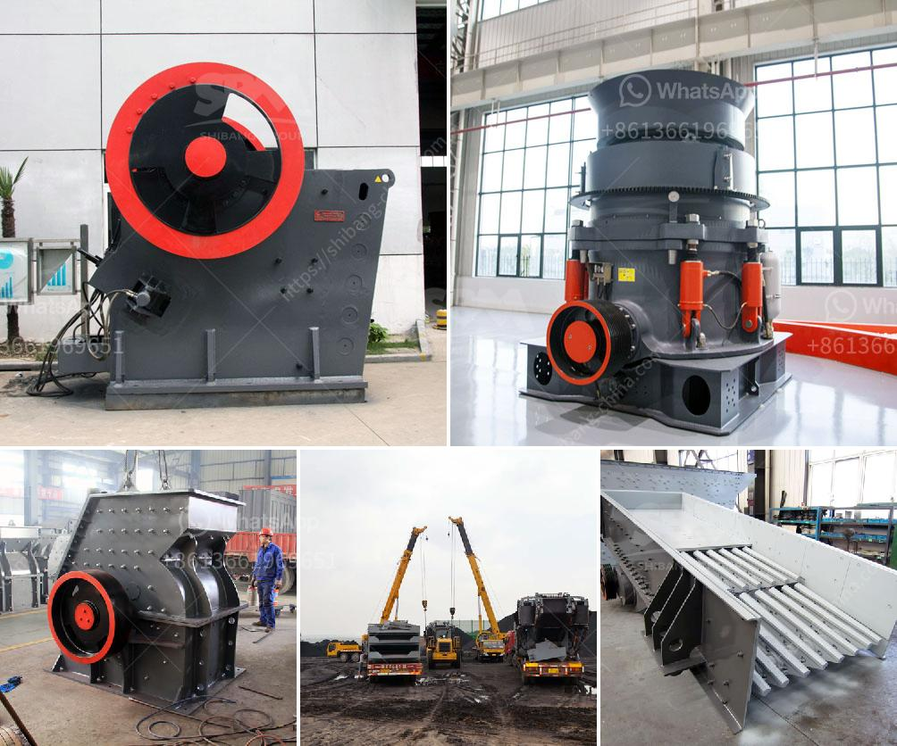

<h3>sand dryer machine italy</h3>
When it comes to efficiently drying sand, Italy is at the forefront of innovation with its specialized sand dryer machines. These machines have revolutionized the drying process, making it quicker, more reliable, and energy-efficient. In this article, we will explore the features and benefits of sand dryer machines in Italy.

Sand drying is a crucial step in various industries, including construction, foundries, and glass manufacturing. Traditionally, this process involved spreading sand in the sun and waiting for it to dry naturally. However, this method was not only time-consuming but also dependent on weather conditions. Moreover, it often resulted in inconsistent moisture levels and impurities in the sand.

With the introduction of sand dryer machines, the drying process has become more streamlined and efficient. These machines are designed to remove excess moisture from sand, reducing its weight and improving its quality. The result is clean, dry sand that is ideal for a wide range of applications.

Italian sand dryer machines are equipped with advanced technology and tailored features to optimize the drying process. They typically consist of a rotating drum, a burner, a fan, and a heat source. The sand is placed inside the rotating drum, which is heated by the burner. The fan creates a steady airflow within the drum, facilitating the evaporation of moisture from the sand.

One notable feature of sand dryer machines in Italy is their energy efficiency. These machines are engineered to minimize energy consumption while maximizing drying performance. They use advanced heat recovery systems to capture and reuse the heat generated during the drying process. This helps reduce operating costs and environmental impact.

The drying capacity of sand dryer machines in Italy varies depending on the model and manufacturer. They can handle large quantities of sand, ranging from a few tons to several hundred tons per hour. This makes them suitable for both small-scale and large-scale production operations.

Moreover, sand dryer machines in Italy are designed to ensure even and consistent drying. They are equipped with temperature and moisture sensors that continuously monitor the drying process, allowing for precise control and adjustment. This ensures that the sand is dried to the desired moisture level, eliminating the risk of over-drying or under-drying.

In addition to their technical features, sand dryer machines in Italy are known for their durability and reliability. Italian manufacturers prioritize the use of high-quality materials and strict quality control measures to ensure that their machines can withstand the demanding conditions of industrial applications. They also offer comprehensive after-sales support, including maintenance services and spare parts availability.

In conclusion, sand dryer machines in Italy have revolutionized the drying process by providing a faster, more reliable, and energy-efficient solution. Their advanced technology, tailored features, and high drying capacity make them an ideal choice for various industries. By investing in these machines, businesses can improve their productivity, reduce costs, and enhance the quality of their sand products. With Italy's expertise and innovation, sand drying has never been more efficient.
<h3>Contact us</h3><ul><li><strong>Whatsapp:&nbsp;<a href="https://wa.me/8613661969651">+8613661969651</a></strong></li><li><a href="https://swt.shibang-china.com/?git&amp;zhl&amp;sand dryer machine italy"><strong>Online Service(chat now)</strong></a></li></ul><h3>Related</h3><ul><li><a href='crawler type mobile crushers.md'>crawler type mobile crushers</a></li><li><a href='gypsum board plant cost.md'>gypsum board plant cost</a></li><li><a href='calcium phosphate crusher.md'>calcium phosphate crusher</a></li><li><a href='second hand conveyor belt adelaide.md'>second hand conveyor belt adelaide</a></li><li><a href='machine crusher prices in nigeria.md'>machine crusher prices in nigeria</a></li></ul>