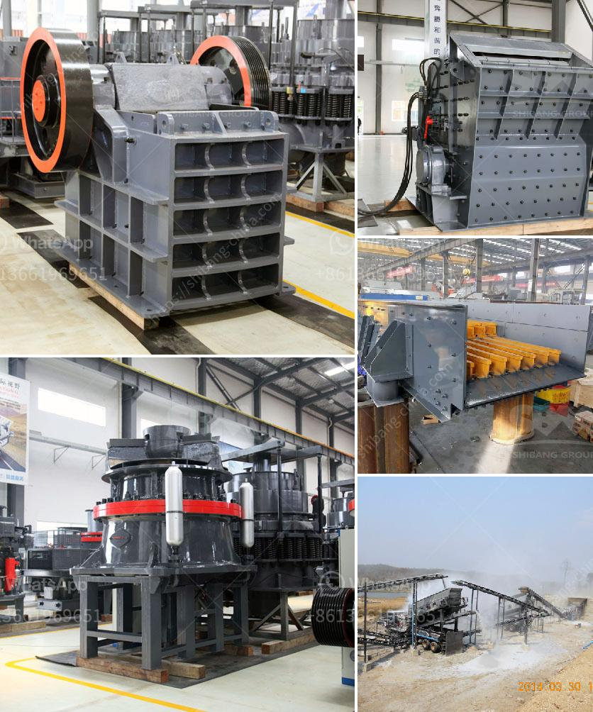

<h3>sand making crusher machine</h3>
Sand making machines have become one of the key machines used in mining, construction, and infrastructure projects. They provide high-quality sand and gravel aggregates for highways, railways, bridges, airports, and high-rise buildings. With the rapid development of the construction industry, the demand for sand and gravel aggregates has been increasing. In response to this demand, the sand making crusher machine has emerged as a key equipment.

The sand making crusher machine is mainly used for crushing and shaping various types of rocks, stones, and ore materials. The following are some common types and models of sand making machines:

1. Jaw crusher: This is a traditional and reliable primary crushing machine. It is often used to crush large rocks or ores.

2. Impact crusher: It is a highly efficient and energy-saving crushing machine. It can process various materials with a particle size of less than 500 mm and a compressive strength of up to 360 MPa.

3. Cone crusher: As a secondary crushing machine, it can process materials with a feed size of 35-300 mm and a production capacity of 12-1000 t/h. It is suitable for crushing various medium-hard and hard materials.

4. Vertical shaft impact crusher (VSI crusher): With a capacity of 60-600 t/h, this sand making machine has a unique rotor structure and is equipped with high wear-resistant materials.

The sand making crusher machine adopts deep-cavity rotor technology and a unique air circulation system, which can reduce the wear of key parts and greatly improve the quality of finished sand. It has a simple structure, stable performance, and low operating cost.

The sand making machine is designed with adjustable feed size, simple and reliable operation, and a convenient maintenance system. It has a wide range of applications and can be used for artificial sand making of various types of hard and soft rocks, such as river pebbles, granite, basalt, and limestone.

In addition to the sand making crusher machine, the selection of sand making process is also crucial. Generally, the process includes coarse crushing, medium crushing, fine crushing, sand making, and sand washing. Depending on the specific requirements of the project, different equipment configurations can be selected.

The sand making process is environmentally friendly and efficient. It uses advanced dry sand production technology, combined with efficient dust removal equipment, to effectively control the emission of dust and noise. At the same time, the sand production process adopts closed circulation, which can save water resources and protect the environment.

In conclusion, the sand making crusher machine plays a vital role in the development of the construction industry. It provides high-quality sand and gravel aggregates for infrastructure projects and promotes the sustainable development of the industry. With continuous technological advancements, sand making machines will continue to improve in terms of performance, efficiency, and environmental protection, further meeting the needs of various construction projects.
<h3>Contact us</h3><ul><li><strong>Whatsapp:&nbsp;<a href="https://wa.me/8613661969651">+8613661969651</a></strong></li><li><a href="https://swt.shibang-china.com/?git&amp;zhl&amp;sand making crusher machine"><strong>Online Service(chat now)</strong></a></li></ul><h3>Related</h3><ul><li><a href='canadian gold mining equipment manufacturers.md'>canadian gold mining equipment manufacturers</a></li><li><a href='quarry rock crusher.md'>quarry rock crusher</a></li><li><a href='south africa jaw crushers.md'>south africa jaw crushers</a></li><li><a href='aggregate crusher for sale in philippines.md'>aggregate crusher for sale in philippines</a></li><li><a href='100tph stone crushing and screening plant.md'>100tph stone crushing and screening plant</a></li></ul>