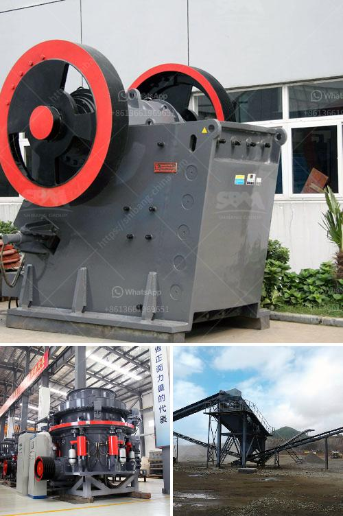

<h3>sand making machine kenya</h3>
The sand making machine is an essential equipment used in the production of sand and gravel. It forms a complete set of production line together with other mining machinery and equipment, such as crushers, vibrating screens, feeders, and conveyors. It is widely used in the construction industry, metallurgy industry, and chemical industry.

Kenya is a developing country with limited natural resources. Its construction industry is booming, which also promotes the development of sand making machines. In recent years, Kenya has expanded infrastructure construction to promote economic development. The construction of highways, railways, and other large projects has driven the demand for sand and gravel, making the sand making machine more popular.

The sand making machine is also called sand making machine. It is mainly used to finely crush various ores and rocks, and is widely used in construction sand, construction sand, cement plants, hydropower stations, concrete dam sites, glass factories, and oil well backfilling materials. Industries such as sand, building and road construction provide high-quality sand and gravel aggregates.

The sand making machine has many advantages. First, the sand making machine has a simple structure, convenient operation and maintenance, and low energy consumption. It only needs to be a small building area, which can greatly reduce the construction cost, and improve work efficiency. Second, the sand making machine has high crushing efficiency and excellent grain shape. It has a unique design of a deep cavity impeller, which increases the throughput by 30%, and ensures the output grain size is uniform and the quality is excellent.

Sand making machines produced in Kenya are welcomed by the local people and the local market. The main reason is that the sand making machine produced by SBM Industrial Technology Group has excellent performance, and the quality of the produced sand and gravel is very good. The sand making machine produced in Kenya has brought considerable benefits to the construction industry.

In addition, the sand making machine produced by SBM Industrial Technology Group is environmentally friendly and energy-saving. It uses clean energy instead of traditional diesel generators and has low noise pollution during operation. The sand making machine has a long service life and low maintenance rate, which greatly reduces the maintenance cost of the sand making machine.

In summary, the sand making machine is a necessary equipment for the production of sand and gravel. As Kenya's infrastructure construction continues to advance, the demand for sand and gravel is increasing, and the sand making machine produced in Kenya has high quality and excellent performance, which has been recognized and favored by the local people.
<h3>Contact us</h3><ul><li><strong>Whatsapp:&nbsp;<a href="https://wa.me/8613661969651">+8613661969651</a></strong></li><li><a href="https://swt.shibang-china.com/?git&amp;zhl&amp;sand making machine kenya"><strong>Online Service(chat now)</strong></a></li></ul><h3>Related</h3><ul><li><a href='dolomite grinding roller mill manufacturers india.md'>dolomite grinding roller mill manufacturers india</a></li><li><a href='quartz silica crushing unit.md'>quartz silica crushing unit</a></li><li><a href='dolomite crusher manufacturer in nagpur.md'>dolomite crusher manufacturer in nagpur</a></li><li><a href='what is the meaning of 100tph in crusher crusher.md'>what is the meaning of 100tph in crusher crusher</a></li><li><a href='vertical mills nigeria ball mill catalog.md'>vertical mills nigeria ball mill catalog</a></li></ul>