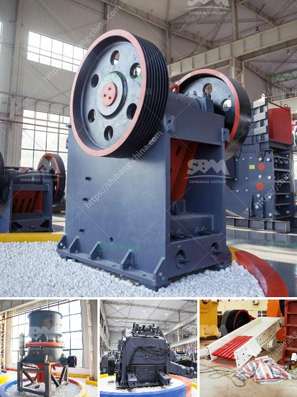

<h3>sand mining equipment manufacturer in south africa</h3>
Sand mining is a lucrative business in South Africa. With the construction industry booming, the demand for building materials such as sand is constantly increasing. Unfortunately, indiscriminate mining of sand from riverbeds and other natural resources such as beaches and dunes is taking a toll on the environment.

To address this issue, there is a need for sustainable and efficient sand mining equipment that can provide reliable and effective results. This is where equipment manufacturers in South Africa come into play. These manufacturers specialize in developing customized solutions to suit the specific needs of sand mining companies.

One such company is XSM Mining Equipment, a renowned sand mining equipment manufacturer in South Africa. It specializes in the production of various types of equipment, including crushers, vibrating screens, and sand washing machines. They offer high-quality machinery with reliable performance and long service life.

XSM Mining Equipment has a team of skilled engineers who work closely with their clients to understand their specific requirements. By providing customized solutions, they ensure that the equipment meets the client's needs and helps them achieve their production goals effectively.

Their range of sand mining equipment includes various types of crushers. These crushers are designed to reduce large rocks into smaller-sized rocks or gravel. They are essential in breaking down the mined sand into desired sizes for construction purposes. XSM Mining Equipment offers various types of crushers, including jaw crushers, cone crushers, and impact crushers, providing options for different applications and production capacities.

In addition to crushers, XSM Mining Equipment also manufactures vibrating screens. These screens are vital in the sand mining process as they separate the desired sand from other materials. By adjusting the size of the screen opening, the manufacturers can control the size of the final product.

Another crucial equipment provided by XSM Mining Equipment is the sand washing machine. After the sand is mined, it contains impurities that need to be removed for construction use. The sand washing machine helps clean and separate the impurities from the sand, ensuring that the end product is of high quality and suitable for construction purposes.

XSM Mining Equipment's sand mining machinery is designed and developed based on years of experience and continuous innovation. They prioritize efficiency, reliability, and environmental sustainability in their manufacturing process. The equipment is built with high-quality materials and cutting-edge technology, ensuring durability and optimum performance.

Moreover, XSM Mining Equipment provides excellent after-sales service, including installation, operation training, and technical support. Their knowledgeable team is always ready to assist clients in maximizing the productivity and efficiency of their sand mining operations.

In conclusion, sand mining equipment manufacturers in South Africa play a pivotal role in the continued development of the construction industry. The lucrative business of sand mining necessitates durable, efficient, and environmentally conscious equipment. XSM Mining Equipment is a leading sand mining equipment manufacturer in South Africa, supplying customers with high-quality and reliable solutions for their sand mining needs.
<h3>Contact us</h3><ul><li><strong>Whatsapp:&nbsp;<a href="https://wa.me/8613661969651">+8613661969651</a></strong></li><li><a href="https://swt.shibang-china.com/?git&amp;zhl&amp;sand mining equipment manufacturer in south africa"><strong>Online Service(chat now)</strong></a></li></ul><h3>Related</h3><ul><li><a href='germany stone crusher machine factories.md'>germany stone crusher machine factories</a></li><li><a href='gypsum crusher for sale india.md'>gypsum crusher for sale india</a></li><li><a href='crushers double toggle.md'>crushers double toggle</a></li><li><a href='roll crushers for sale.md'>roll crushers for sale</a></li><li><a href='250 400 pe jaw crusher price list.md'>250 400 pe jaw crusher price list</a></li></ul>