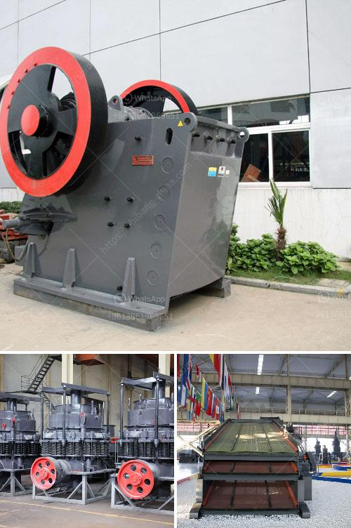

<h3>sand sieve machine philippines</h3>
The Philippines, being a country surrounded by water and blessed with beautiful beaches, has always had a high demand for sand. Construction and infrastructure development projects continually require large quantities of sand to meet the growing needs of the nation. To efficiently produce quality sand for these purposes, the use of sand sieve machines has become crucial.

A sand sieve machine is a tool used to separate sands, gravels, and other particles in order to produce pure and fine sand. It is the primary equipment in various sand production lines. With its unique size and high efficiency, the sand sieve machine has played an active role in the construction and infrastructure development industry in the Philippines.

One notable manufacturer and supplier of sand sieve machines in the Philippines is LZZG. LZZG is a professional mining machinery manufacturer that specializes in developing innovative sand washing technology. Their sand sieve machine is designed to clean fine sand particles and separate them from unwanted particles, providing a comprehensive solution for the production of high-quality sand.

The sand sieve machine from LZZG ensures efficient sand screening and accurate separation, capable of removing impurities such as mud and water. It is widely used in various industries such as mining, construction, and sand production. Moreover, the machine comes with customizable options to meet specific requirements and can be easily integrated into existing sand washing systems. Its robust construction, low maintenance, and high durability make it a reliable choice for sand producers in the Philippines.

In conclusion, the sand sieve machine has proven to be an essential tool in the Philippines, enabling the production of pure and fine sand for various construction and infrastructure development projects. With the advanced sand washing technology from manufacturers such as LZZG, the country can efficiently and sustainably meet its growing sand demand.
<h3>Contact us</h3><ul><li><strong>Whatsapp:&nbsp;<a href="https://wa.me/8613661969651">+8613661969651</a></strong></li><li><a href="https://swt.shibang-china.com/?git&amp;zhl&amp;sand sieve machine philippines"><strong>Online Service(chat now)</strong></a></li></ul><h3>Related</h3><ul><li><a href='price crusher price bolivia.md'>price crusher price bolivia</a></li><li><a href='high efficiency manganese ore raymond mill in india.md'>high efficiency manganese ore raymond mill in india</a></li><li><a href='chrome processing plant price.md'>chrome processing plant price</a></li><li><a href='stone gravel crusher price at ranchi.md'>stone gravel crusher price at ranchi</a></li><li><a href='how much cost to establish stone crusher south africa.md'>how much cost to establish stone crusher south africa</a></li></ul>