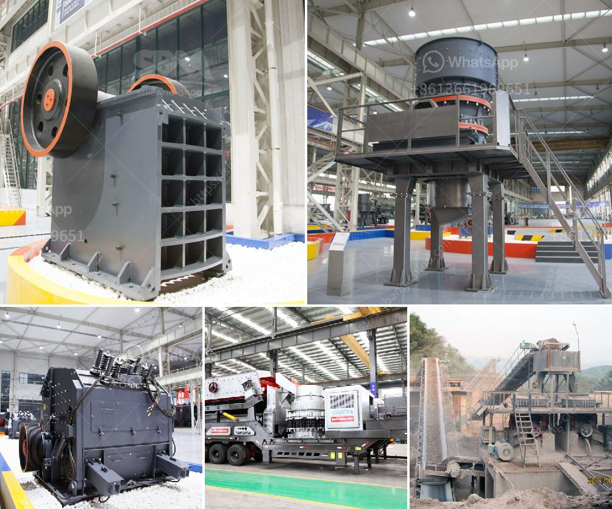

<h3>sand vsi crusher</h3>
In the construction industry, the demand for sand is overwhelming. It is a crucial component for various applications such as concrete production, asphalt mix, and landscaping. However, the natural sources of sand are rapidly depleting, leading to an enormous environmental concern. As a result, alternative methods to obtain sand have gained significant attention, and one such method is the use of VSI crushers.

VSI (Vertical Shaft Impactor) crushers are widely used in the mining and aggregate industries due to their high efficiency in shaping the particle size and producing quality sand. The VSI crusher works by accelerating rocks or stones into a centrifugal chamber where they are crushed into smaller sizes. The high-speed rotating impeller then flings the materials against the breaker plates, resulting in the formation of cubical-shaped particles.

One of the major advantages of using a VSI crusher for sand production is its ability to produce a consistent and well-graded sand. Unlike natural sand, which varies in its particle sizes and shape, the VSI crusher ensures a uniform particle distribution. This consistency is crucial for achieving the desired strength and workability of concrete mixes. Moreover, the cubical shape of the particles enhances the flowability of concrete, reducing the need for excess water, cement, and additives.

Additionally, VSI crushers offer superior control over the sand production process. By adjusting the rotor speed and the cascade ratio (the ratio of rock-on-rock impact crushing to rock-on-steel impact crushing), operators can precisely control the gradation and shape of the sand produced. This level of control allows for customization to meet the specific requirements of different applications, resulting in optimized performance and cost savings.

Another notable advantage of VSI crushers is their minimal impact on the environment. Traditional sand mining methods involve dredging rivers and lakes, leading to habitat destruction, erosion, and water pollution. In contrast, VSI crushers rely on aggregate materials, such as granite or basalt, which can be sourced from quarries or construction waste. This not only reduces the ecological impact but also helps in managing waste and promoting sustainable practices in the industry.

Furthermore, the maintenance and operational costs of VSI crushers are comparatively lower than other sand production methods. The design of VSI crushers allows for easy access to its components, making maintenance and repairs relatively straightforward. Additionally, due to the efficient crushing mechanism and precise control of particle sizes, VSI crushers often require less energy and produce less wear on the internal components. This translates into cost savings in terms of energy consumption and wear part replacements.

In conclusion, the use of VSI crushers for sand production is a game-changer in the construction industry. They offer a sustainable and environmentally friendly solution to the growing demand for sand, while providing high-quality and consistent sand for construction purposes. The ability to control particle sizes and shape further enhances the versatility and performance of VSI crushers. With their low maintenance requirements and cost-effective operation, VSI crushers are paving the way for a more efficient and sustainable future in the construction industry.
<h3>Contact us</h3><ul><li><strong>Whatsapp:&nbsp;<a href="https://wa.me/8613661969651">+8613661969651</a></strong></li><li><a href="https://swt.shibang-china.com/?git&amp;zhl&amp;sand vsi crusher"><strong>Online Service(chat now)</strong></a></li></ul><h3>Related</h3><ul><li><a href='costs a stone crushing machine when a stone crusher.md'>costs a stone crushing machine when a stone crusher</a></li><li><a href='stone crushing project complete quarry project machine.md'>stone crushing project complete quarry project machine</a></li><li><a href='gypsum powder making germany machinery.md'>gypsum powder making germany machinery</a></li><li><a href='type of crusher machine is best.md'>type of crusher machine is best</a></li><li><a href='bentonite crushing machine.md'>bentonite crushing machine</a></li></ul>