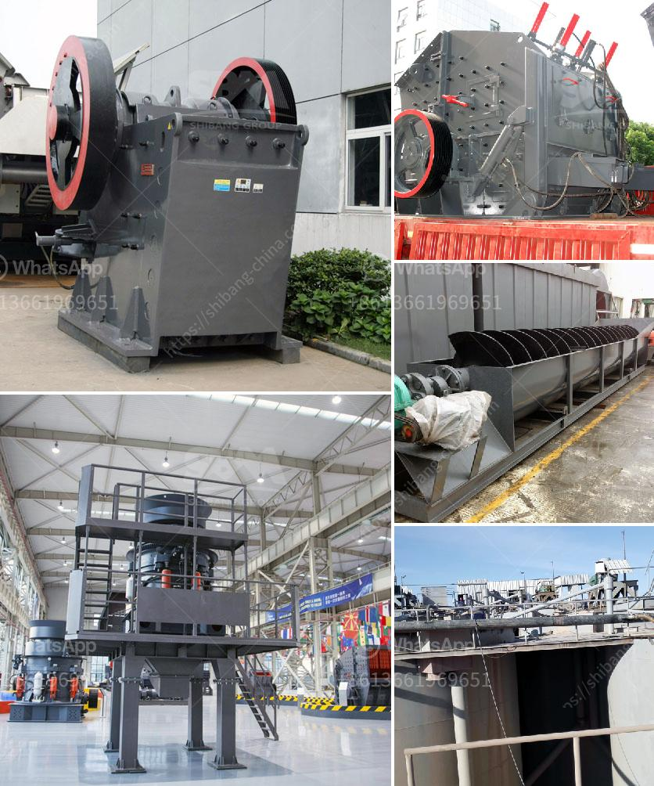

<h3>sand washer for price</h3>
Sand is one of the most commonly used materials in various industries, such as construction, manufacturing, and landscaping. However, the process of extracting sand from natural sources leaves it contaminated with impurities, making it unsuitable for direct use. To address this issue, sand washers have emerged as a practical solution to clean and recycle sand efficiently. In this article, we will explore the benefits and features of sand washers and discuss their pricing to help you make an informed decision.

1. Efficient Cleaning: A primary advantage of using a sand washer is its ability to remove impurities and dirt from sand effectively. The machine utilizes a rotating spiral to agitate the sand, scrubbing away contaminants and leaving behind clean, high-quality sand. By ensuring the cleanliness of the sand, a sand washer facilitates the production of better-quality products and enhances overall productivity.

2. Water Conservation: Sand washing is a water-intensive process, and sand washers are designed to optimize water usage. These machines have built-in water tanks, pumps, and recycling systems that minimize water consumption. By reusing the same water, sand washers contribute to water conservation efforts and reduce the environmental impact of sand extraction and processing.

3. Minimal Maintenance: Sand washers are designed for robustness and durability, ensuring minimal maintenance requirements. With a sturdy construction and well-engineered components, these machines can withstand harsh working conditions and prolonged use, resulting in reduced downtime and repair costs. Additionally, they are equipped with automated systems that eliminate the need for extensive manual supervision during operation.

The price of a sand washer can vary based on several factors, including its capacity, features, and brand. Generally, sand washers with higher capacities and advanced features are priced higher than basic models. However, it is crucial to consider the long-term benefits and cost savings associated with each option before making a decision solely based on price.

In the market, sand washers typically range in price from $500 to $2000, depending on their specifications. Some premium models with high capacity and advanced features may be priced above $2000. It is essential to evaluate your specific requirements and budget before selecting a sand washer that best fits your needs.

Sand washers play a crucial role in ensuring the cleanliness and quality of sand used in various industries. These machines efficiently remove impurities from sand, conserve water, and require minimal maintenance. While the price of sand washers may vary, it is essential to consider their long-term benefits when making a purchasing decision. Investing in a sand washer can enhance overall productivity, improve product quality, and contribute to a more sustainable environment.
<h3>Contact us</h3><ul><li><strong>Whatsapp:&nbsp;<a href="https://wa.me/8613661969651">+8613661969651</a></strong></li><li><a href="https://swt.shibang-china.com/?git&amp;zhl&amp;sand washer for price"><strong>Online Service(chat now)</strong></a></li></ul><h3>Related</h3><ul><li><a href='fluorite processing.md'>fluorite processing</a></li><li><a href='ball mills for cement grinding.md'>ball mills for cement grinding</a></li><li><a href='hammer mill bison price.md'>hammer mill bison price</a></li><li><a href='cone crusher in mexico.md'>cone crusher in mexico</a></li><li><a href='cobble stone project in ethiopia.md'>cobble stone project in ethiopia</a></li></ul>