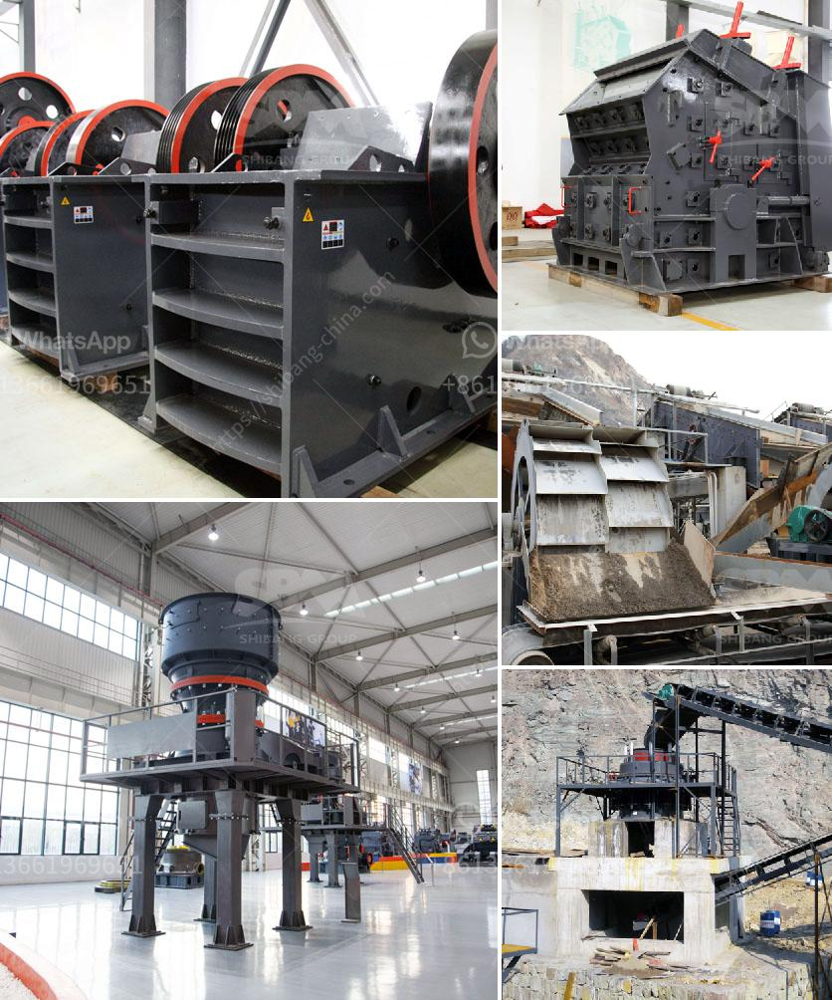

<h3>sand washing machine lsx920</h3>
The sand washing machine LSX920 is a highly efficient machine designed with the latest technology for washing and dewatering sand. This machine has two functions: washing and dewatering. It is an ideal choice for sand production lines and sand washing plants.

The LSX920 sand washing machine is made of high-quality materials. It has a simple structure, stable performance, and long service life. This machine is equipped with a wheel-type sand washing and recycling system. The sand and water mixture is fed into the washing tank, where the impeller rotates and pushes the sand to achieve the purpose of cleaning. After the cleaning process, the clean sand is lifted by the impeller, and the water is drained out through the overflow tank.

One of the main features of the LSX920 sand washing machine is its high washing efficiency. The impeller and the spiral blades are made of wear-resistant material, ensuring the machine's durability and high cleaning efficiency. The sand washing machine can remove impurities such as mud, dust, and stone powder that are mixed in the sand. It provides a clean and high-quality sand product, which is essential for the construction industry.

Moreover, the LSX920 sand washing machine has a dewatering function, which can greatly reduce the moisture content in the washed sand. By using the dewatering screen, the machine can remove the extra water in the sand, making it dry enough to meet the market requirements. This feature is particularly useful in regions where water resources are scarce, as it helps conserve water during the washing process.

Another advantage of the LSX920 sand washing machine is its compact design. The machine is small in size, lightweight, and easy to install. It can be used in various sand production lines and sand washing plants without occupying much space. The compact design also makes it easy to transport and move from one site to another, providing great flexibility and convenience for users.

In terms of operation and maintenance, the LSX920 sand washing machine is user-friendly. It is equipped with an automatic control system, which allows for easy operation and monitoring. The machine also has a low energy consumption, saving costs on electricity. Regular maintenance is required to ensure the machine's optimal performance, but it is relatively easy to maintain with regular cleaning and lubrication.

In conclusion, the LSX920 sand washing machine is a high-quality and efficient machine for washing and dewatering sand. Its compact design, high washing efficiency, and dewatering function make it an ideal choice for sand production lines and sand washing plants. With its user-friendly operation and maintenance, this machine provides a reliable and sustainable solution for sand cleaning and drying requirements.
<h3>Contact us</h3><ul><li><strong>Whatsapp:&nbsp;<a href="https://wa.me/8613661969651">+8613661969651</a></strong></li><li><a href="https://swt.shibang-china.com/?git&amp;zhl&amp;sand washing machine lsx920"><strong>Online Service(chat now)</strong></a></li></ul><h3>Related</h3><ul><li><a href='trackmounted crushing.md'>track-mounted crushing</a></li><li><a href='small gold mining plant in south africa.md'>small gold mining plant in south africa</a></li><li><a href='vertical shaft impact crusher for sale.md'>vertical shaft impact crusher for sale</a></li><li><a href='5 raymond roller mill.md'>5 raymond roller mill</a></li><li><a href='used vertical grinding machine.md'>used vertical grinding machine</a></li></ul>