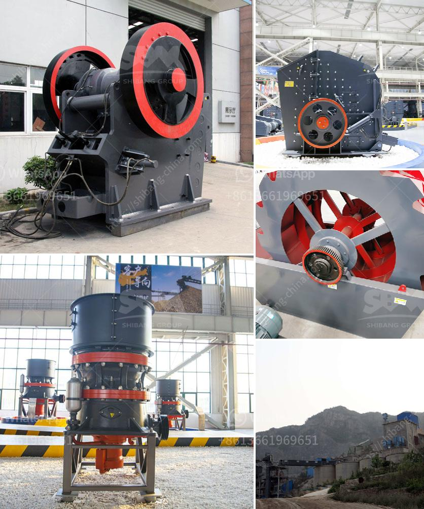

<h3>sand washing machines for crusher nepal</h3>
Sand washing machines are an essential component for any sand production process in the construction industry, whether it's for making concrete, asphalt, or even glass. Crusher Nepal is a leading supplier and manufacturer of these machines in the country, providing a range of sand washing solutions for different applications.

One of the primary advantages of sand washing machines is their ability to remove impurities and contaminants from sand, ensuring that the final product meets the desired specifications. These machines use water as a medium to wash and separate the sand particles, effectively removing any unwanted materials such as clay, silt, or organic matter. By doing so, they improve the quality and consistency of the sand, making it suitable for various construction purposes.

The sand washing machines from Crusher Nepal are designed to handle different capacities, ranging from 100 to 300 tons per hour. This versatility allows them to cater to both small and large-scale projects. The machines are equipped with powerful motors and advanced technology to ensure efficient and thorough cleaning of the sand.

Moreover, the sand washing machines are also designed to be environmentally friendly. They recycle a significant amount of water used during the process, reducing water consumption and minimizing the impact on the natural resources. Additionally, the machines are built with sturdy materials and undergo stringent quality control measures, ensuring durability and long-term performance.

Another key feature of these sand washing machines is their ease of operation and maintenance. Crusher Nepal provides comprehensive training and assistance to their clients, enabling them to operate the machines efficiently. Regular maintenance services and spare parts are also readily available, ensuring uninterrupted and hassle-free operations.

In conclusion, sand washing machines are vital for any construction project that requires clean and high-quality sand. The range of machines offered by Crusher Nepal provides reliable and efficient solutions for sand washing, allowing customers to achieve superior results in their construction endeavors. With their durability, eco-friendliness, and ease of operation, these machines are a valuable asset for any sand production process.
<h3>Contact us</h3><ul><li><strong>Whatsapp:&nbsp;<a href="https://wa.me/8613661969651">+8613661969651</a></strong></li><li><a href="https://swt.shibang-china.com/?git&amp;zhl&amp;sand washing machines for crusher nepal"><strong>Online Service(chat now)</strong></a></li></ul><h3>Related</h3><ul><li><a href='feasibility study for coal mining.md'>feasibility study for coal mining</a></li><li><a href='crawler mobile jaw crusher for sale.md'>crawler mobile jaw crusher for sale</a></li><li><a href='rock crusher for sale in sudan.md'>rock crusher for sale in sudan</a></li><li><a href='grinding mill manufacturer in italy.md'>grinding mill manufacturer in italy</a></li><li><a href='river stone crusher.md'>river stone crusher</a></li></ul>