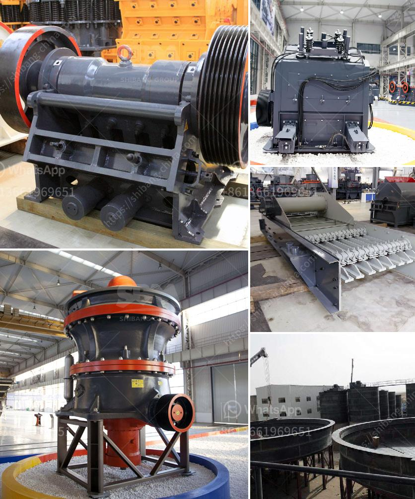

<h3>sand washing plant price</h3>
Sand washing plant is a popular option for many businesses to wash and process sand, due to its wide range of benefits. This equipment will help to clean sand effectively, extract unwanted impurities, and improve the quality of sand to be used in various construction applications.

When considering investing in a sand washing plant, one crucial factor to consider is the price. The cost of a sand washing plant can vary depending on the size and capacity of the plant, the type of equipment used, and the manufacturer. Additionally, the price may also depend on the specific requirements and customization needed for a project.

Generally, sand washing plants with higher capacities and more advanced features tend to have higher prices. However, investing in a higher-priced plant can be a wise decision in the long run, as it can offer better performance, increased productivity, and reduced operational costs.

The price range for small to medium-sized sand washing plants can start from around $25,000 and can go up to as high as $400,000 or more, depending on the specifications. These prices are also subject to fluctuation due to market demand and supply chain factors.

It is essential to conduct thorough research, compare prices from different manufacturers, and consider the reputation and quality of the equipment before making a final decision. In addition, considering the after-sales services, warranty, and availability of spare parts should be taken into account to ensure a smooth and efficient operation of the sand washing plant in the long term.

In conclusion, the price of a sand washing plant can vary based on several factors. It is crucial to consider the capacity, features, customization needs, and the reputation of the manufacturer when determining the price range. Investing in a high-quality sand washing plant may come at a higher price initially, but it can offer improved performance, efficiency, and long-term cost savings for the business.
<h3>Contact us</h3><ul><li><strong>Whatsapp:&nbsp;<a href="https://wa.me/8613661969651">+8613661969651</a></strong></li><li><a href="https://swt.shibang-china.com/?git&amp;zhl&amp;sand washing plant price"><strong>Online Service(chat now)</strong></a></li></ul><h3>Related</h3><ul><li><a href='hammer mill in japan.md'>hammer mill in japan</a></li><li><a href='coal mill reject conveying system.md'>coal mill reject conveying system</a></li><li><a href='gyratory crusher advantages and disadvantages.md'>gyratory crusher advantages and disadvantages</a></li><li><a href='small scale sand washer machines.md'>small scale sand washer machines</a></li><li><a href='indonesia hammer mill for sale.md'>indonesia hammer mill for sale</a></li></ul>