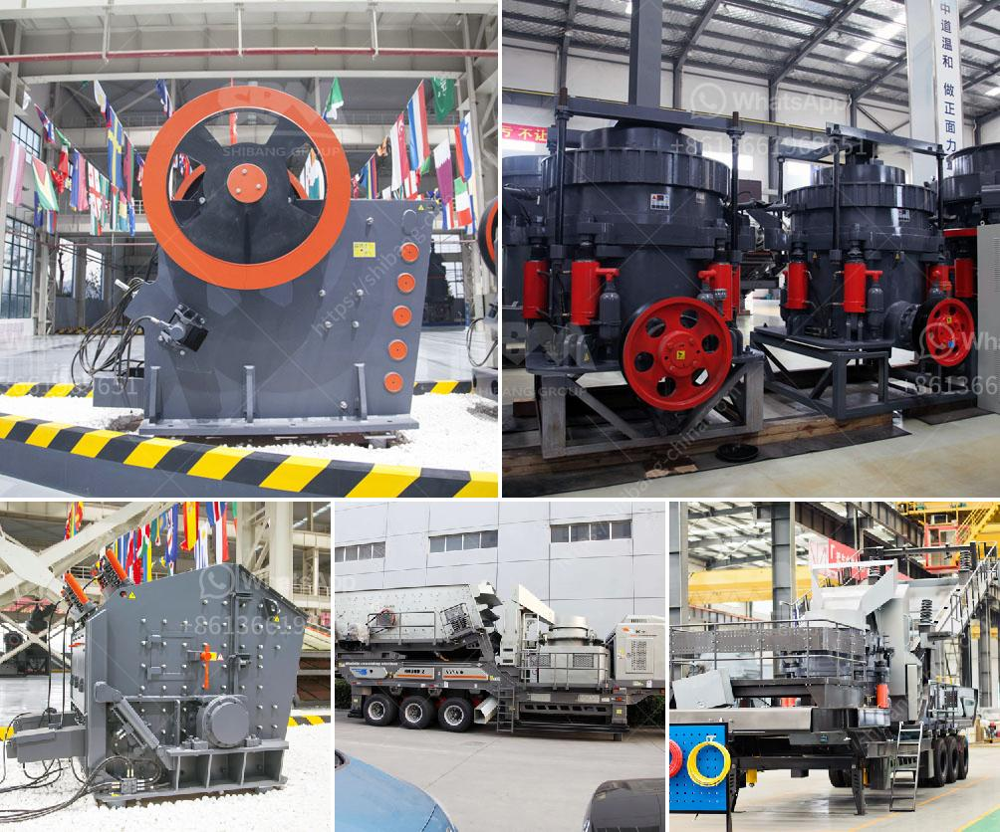

<h3>sand washing system</h3>
Sand washing systems are essential in various industries, such as construction, mining, and agriculture, where sand plays a vital role. These systems ensure that sand is clean, free from impurities, and ready to be used for different applications. A sand washing system typically consists of a sand washer, a dewatering screen, hydrocyclones, and a settling tank.

The sand washer is the main component of the system and is responsible for washing the sand by agitating it with water. It removes clay, silt, and other impurities from the sand particles, ensuring a clean and high-quality final product. The dewatering screen then removes excess moisture from the washed sand, improving its consistency and making it suitable for further use.

Hydrocyclones are used in some sand washing systems to separate fine particles from the sand mixture. These cyclone-like devices create a swirling motion that separates the heavier particles, such as sand, from lighter ones, such as clay or organic matter. This process enhances the efficiency of the washing system, ensuring a better quality of sand.

The settling tank is the final component of the sand washing system and is used to store and clarify the washed sand. It allows any remaining impurities or fine particles to settle down, ensuring that the sand collected is truly clean and ready for use. The settled material can be disposed of, recycled, or used for other purposes.

Overall, a sand washing system is a crucial investment for industries that rely on clean sand. It improves the quality of sand, enhances productivity, and reduces the environmental impact of sand extraction and processing. By investing in a reliable sand washing system, businesses can ensure a consistent supply of high-quality sand and maintain their competitive edge in the market.
<h3>Contact us</h3><ul><li><strong>Whatsapp:&nbsp;<a href="https://wa.me/8613661969651">+8613661969651</a></strong></li><li><a href="https://swt.shibang-china.com/?git&amp;zhl&amp;sand washing system"><strong>Online Service(chat now)</strong></a></li></ul><h3>Related</h3><ul><li><a href='pe 400 jaw crusher.md'>pe 400 jaw crusher</a></li><li><a href='crawler mobile jaw crusher for sale.md'>crawler mobile jaw crusher for sale</a></li><li><a href='ethiopia stone crushing plant.md'>ethiopia stone crushing plant</a></li><li><a href='automatic feeder for ball mill customer case.md'>automatic feeder for ball mill customer case</a></li><li><a href='china raymond roller mills.md'>china raymond roller mills</a></li></ul>