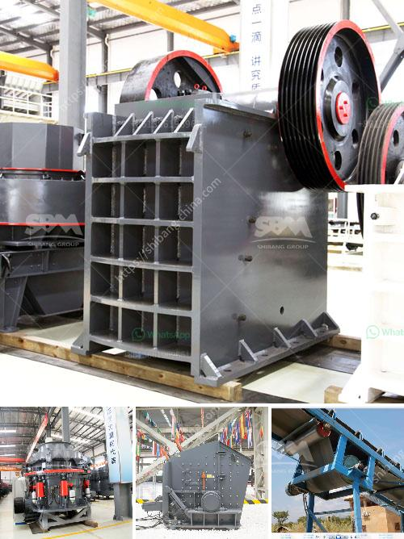

<h3>sayaji crusher pdf</h3>
Sayaji Crusher is an essential equipment in the industrial sector for crushing rocks. It is used extensively in mining, cement, glass, and chemical industries and is known for its high-efficiency and capacity. It is highly versatile and can be used for crushing a variety of materials including stones, quartzite, rocks, coke, iron ore, bauxite, and many more.

The Sayaji Crusher is designed to be sturdy and durable to withstand heavy-duty operations. The machine is made with high-quality components that contribute to its exceptional performance. It consists of a frame, a fixed jaw plate, a movable jaw plate, an eccentric shaft, toggle plates, and an isometric drawing. The crusher is easy to maintain and requires minimal maintenance, which makes it a cost-effective choice for industries.

One of the standout features of the Sayaji Crusher is its user-friendly nature. The machine provides easy operation and maintenance for operators and ensures safety during crushing. It comes with a centralized lubrication system for convenient lubrication, reducing the chances of equipment breakdown and ensuring smooth operations.

The Sayaji Crusher offers a high reduction ratio, allowing users to produce high-quality end products. The machine comes with a unique crushing chamber design that enhances its crushing capabilities. It ensures uniform particle size distribution and a consistent product shape, essential for industries that require a precise final product.

Another significant advantage of the Sayaji Crusher is its energy efficiency. The machine is designed to consume less power while delivering superior performance. This not only reduces energy costs for industries but also contributes to environmental sustainability.

The Sayaji Crusher is available in various models and sizes to meet the diverse crushing needs of industries. It can handle both large and small-scale operations, making it suitable for a wide range of applications. Additionally, customization options are available, allowing customers to tailor the machine to their specific requirements.

To ensure customer satisfaction, Sayaji Crushers are backed by excellent after-sales service. The manufacturer provides prompt technical support and assistance to resolve any issues that may arise. This helps industries minimize downtime and maximize productivity.

In conclusion, the Sayaji Crusher is a reliable and efficient option for industries involved in material crushing. Its user-friendly design, energy efficiency, and high-quality output make it a preferred choice for many organizations. With its robust construction and versatile nature, this crusher offers excellent value for money. Whether it is crushing rocks or recycling materials, the Sayaji Crusher is designed to deliver consistent performance and exceptional results.
<h3>Contact us</h3><ul><li><strong>Whatsapp:&nbsp;<a href="https://wa.me/8613661969651">+8613661969651</a></strong></li><li><a href="https://swt.shibang-china.com/?git&amp;zhl&amp;sayaji crusher pdf"><strong>Online Service(chat now)</strong></a></li></ul><h3>Related</h3><ul><li><a href='gypsum crusher in salalah oman.md'>gypsum crusher in salalah oman</a></li><li><a href='concrete crushers for rent.md'>concrete crushers for rent</a></li><li><a href='limestone processing crusher.md'>limestone processing crusher</a></li><li><a href='hp 500 cone crusher parts.md'>hp 500 cone crusher parts</a></li><li><a href='crush molybdenum equipment.md'>crush molybdenum equipment</a></li></ul>