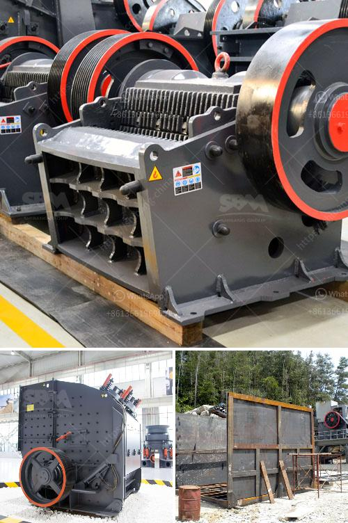

<h3>screen and crusher hire</h3>
In the construction industry, time is of the essence. Efficiency and productivity are critical factors that can make or break a project. With the increasing demand for construction projects of varying scales and complexities, there is a growing need for effective equipment that can streamline operations. This is where screen and crusher hire services come into play.

Screen and crusher hire services provide construction companies with the necessary tools to complete projects on time and within budget. These services allow companies to mobilize specialized equipment that enhances productivity and ensures high-quality results. Whether it's for site preparation, demolition, or recycling, screen and crusher hire services offer a wide range of applications.

One of the primary benefits of screen and crusher hire is the ability to access specialized equipment without the need for capital investment. Construction companies can rent screens and crushers for specific projects, without having to commit to long-term ownership costs. This flexibility allows companies to allocate their resources more efficiently, matching equipment rentals to the project's specific requirements.

Screen and crusher hire services also offer access to modern and technologically advanced equipment. The rental providers regularly update their fleet, ensuring that the machines available for hire are equipped with the latest features and functionalities. This allows construction companies to take advantage of cutting-edge technology without the burden of purchasing expensive equipment that may quickly become outdated.

Another advantage of screen and crusher hire services is the expertise they bring. Rental providers often have experienced professionals who can provide guidance and support during the hiring process. They can advise construction companies on the most suitable equipment for their projects, considering factors such as size, capacity, and mobility. This consultancy service saves companies valuable time and resources by ensuring they make the right equipment choices.

Screen and crusher hire services can significantly improve project efficiency. Screens, for example, are ideal for separating materials of different sizes, ensuring that only the desired particles continue through the construction process. This reduces waste and saves time that would otherwise be spent manually sorting materials. Crushers, on the other hand, are used to break down large rocks into smaller, more manageable sizes, making them easier to transport and work with on-site.

In addition to efficiency gains, screen and crusher hire services also contribute to sustainability efforts in the construction industry. Recycling materials, such as concrete and asphalt, is becoming increasingly important to reduce waste and minimize the use of natural resources. Crushers, particularly mobile ones, enable construction companies to crush and reuse existing materials, reducing the need for new aggregates while reducing carbon emissions associated with transportation.

In conclusion, screen and crusher hire services offer construction companies a range of benefits, from increased efficiency and productivity to access to advanced technology and expertise. By renting specialized equipment, companies can optimize their resources, reduce capital investment, and focus on completing projects within tight deadlines. Moreover, screen and crusher hire services contribute to sustainable construction practices, allowing for the recycling of materials and reducing carbon footprint. With the construction industry continuously evolving, these services are critical tools for success in the modern construction landscape.
<h3>Contact us</h3><ul><li><strong>Whatsapp:&nbsp;<a href="https://wa.me/8613661969651">+8613661969651</a></strong></li><li><a href="https://swt.shibang-china.com/?git&amp;zhl&amp;screen and crusher hire"><strong>Online Service(chat now)</strong></a></li></ul><h3>Related</h3><ul><li><a href='100tpd mini cement plant project cost in india.md'>100tpd mini cement plant project cost in india</a></li><li><a href='mineral processing equipment.md'>mineral processing equipment</a></li><li><a href='mobile iron ore impact crusher suppliers in india.md'>mobile iron ore impact crusher suppliers in india</a></li><li><a href='bentonite production plant machinery.md'>bentonite production plant machinery</a></li><li><a href='quartz powder manufacturing process.md'>quartz powder manufacturing process</a></li></ul>