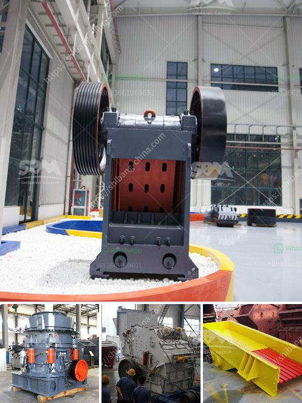

<h3>screen mobile crusher</h3>
The mobile crusher is a machine designed for on-site crushing of different materials. With the advancement in technology and increase in demand, the mobile crusher is becoming more popular in the construction and demolition industry. One type of mobile crusher is the screen mobile crusher, which is equipped with a vibrating screen.

The screen mobile crusher is designed for efficiency, allowing the operator to screen a wide range of materials at once. This means that the crusher can separate and remove unwanted materials from the desired ones, resulting in high-quality end products. It also reduces the need for additional equipment, as the screening process is incorporated into the mobile crusher itself.

One of the key benefits of the screen mobile crusher is its portability. It can be easily transported to different job sites, allowing for on-site crushing and screening of materials. This eliminates the need for transportation of materials to a centralized location, saving time and money.

The vibrating screen of the mobile crusher is designed to provide efficient separation and sorting of materials. It uses a series of screens with different mesh sizes to separate materials based on their size. This ensures that only the desired materials pass through, while the rest are sent for further processing or disposal.

In addition to its efficiency and portability, the screen mobile crusher is also environmentally friendly. It reduces the need for traditional crushers and screeners, which often require significant power and can generate a lot of noise and dust. The screen mobile crusher operates quietly and emits fewer pollutants, making it a more sustainable choice for crushing and screening operations.

Overall, the screen mobile crusher is a versatile and efficient machine that offers numerous benefits in the construction and demolition industry. With its ability to screen and separate materials on-site, it saves time, reduces costs, and provides high-quality end products. As the demand for mobile crushers continues to grow, the screen mobile crusher is poised to play a vital role in the industry.
<h3>Contact us</h3><ul><li><strong>Whatsapp:&nbsp;<a href="https://wa.me/8613661969651">+8613661969651</a></strong></li><li><a href="https://swt.shibang-china.com/?git&amp;zhl&amp;screen mobile crusher"><strong>Online Service(chat now)</strong></a></li></ul><h3>Related</h3><ul><li><a href='jual stone crusher second jakarta.md'>jual stone crusher second jakarta</a></li><li><a href='grinding mill barite.md'>grinding mill barite</a></li><li><a href='crawler portable crusher.md'>crawler portable crusher</a></li><li><a href='crusher machine in china.md'>crusher machine in china</a></li><li><a href='copper recycling process.md'>copper recycling process</a></li></ul>