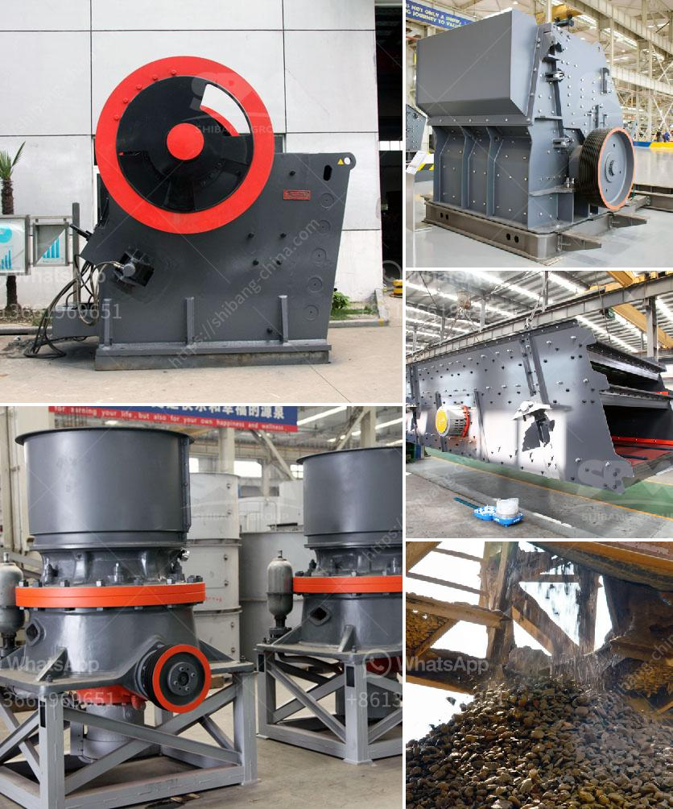

<h3>screen size for kolberg screening plant</h3>
When it comes to selecting the right screening plant for your operation, one of the key factors to consider is screen size. The screen size plays a crucial role in determining the efficiency and effectiveness of the screening process. One screening plant that offers a wide range of screen size options is the Kolberg screening plant.

The Kolberg screening plant is known for its versatility and durability, and it offers a variety of screen sizes to accommodate different applications and materials. From fine screening to heavy-duty screening, this plant has it all. The screen sizes available for the Kolberg screening plant range from small mesh sizes for finer screening to larger mesh sizes for coarser screening.

Having the right screen size is essential for achieving the desired output and meeting the specific requirements of your operation. The smaller screen sizes are ideal for separating fine materials, such as sand and gravel, while the larger screen sizes are better suited for separating larger stones and rocks. The ability to choose from a range of screen sizes allows you to customize the screening process according to your needs.

Moreover, the Kolberg screening plant offers efficient and effective screening solutions for a wide range of industries, including construction, mining, and recycling. Whether you need to process aggregates, topsoil, or compost, this screening plant can handle it all. With its high-capacity screening decks and powerful screening mechanisms, the Kolberg screening plant ensures maximum productivity and outstanding performance.

In conclusion, when it comes to selecting a screening plant, screen size is a critical factor to consider. The Kolberg screening plant offers a wide range of screen sizes, making it a versatile choice for various applications. With its efficient screening capabilities and customizable options, this plant can help optimize your screening process and achieve desired results.
<h3>Contact us</h3><ul><li><strong>Whatsapp:&nbsp;<a href="https://wa.me/8613661969651">+8613661969651</a></strong></li><li><a href="https://swt.shibang-china.com/?git&amp;zhl&amp;screen size for kolberg screening plant"><strong>Online Service(chat now)</strong></a></li></ul><h3>Related</h3><ul><li><a href='stone crusher machine in peru.md'>stone crusher machine in peru</a></li><li><a href='captain of crusher zenith.md'>captain of crusher zenith</a></li><li><a href='mill to pulverize stone crusher.md'>mill to pulverize stone crusher</a></li><li><a href='concrete aggregates crushing plant for sale.md'>concrete aggregates crushing plant for sale</a></li><li><a href='crushing plant tenova.md'>crushing plant tenova</a></li></ul>