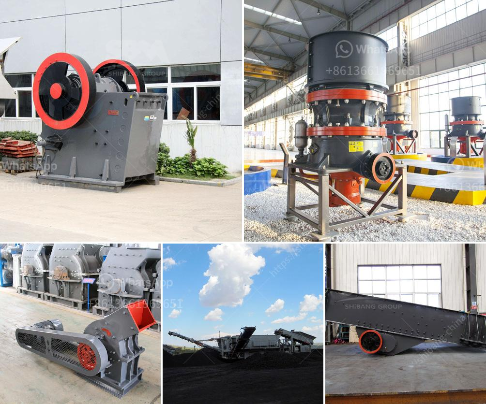

<h3>screening and crusher for sale</h3>
In the modern construction and mining industry, efficient crushing and screening are vital for the success of any project. Whether it is a quarry site or a construction site, the quality of the materials directly impacts the quality of the final product. This is where screening and crusher equipment come into play.

Screening and crusher equipment work hand in hand to ensure efficient and reliable crushing operations. However, finding the right equipment for your needs can be a daunting task. With numerous options available in the market, it is crucial to consider various factors to make an informed choice.

First and foremost, it is important to understand the difference between screening and crusher equipment. Screening equipment, also known as a screener, is used to separate materials into different sizes. This enables the operator to produce materials with the desired specifications, whether it is for aggregate production, recycling, or any other specific application.

On the other hand, crusher equipment is designed to reduce large rocks into smaller rocks, gravel, or rock dust. Crushers can efficiently break down various types of materials, making them suitable for different applications such as construction, mining, and demolition.

When searching for screening and crusher equipment, several factors should be considered. The first and foremost is the capacity and production requirement. It is crucial to choose equipment that can handle the anticipated workload. Whether it is a small-scale project or a large-scale operation, the chosen equipment must be capable of meeting the demand.

Another crucial factor is the type of material that needs to be processed. Different materials require different machinery for efficient crushing and screening. For instance, softer materials like limestone may require different crushing techniques compared to hard materials like granite. Therefore, it is essential to choose equipment that is specifically designed to handle the desired material.

Additionally, the size and mobility of the equipment should be taken into consideration. If the site requires frequent relocation or if there is limited space available, it is important to choose equipment that is easily transportable and occupies less space. This allows for flexibility in moving the equipment to different locations as needed.

One popular option for screening and crushing equipment is a mobile crushing plant. These plants are designed to be compact, highly efficient, and versatile. They can be easily transported to different sites and offer both crushing and screening capabilities. Mobile crushing plants are suitable for a wide range of applications and can handle various materials efficiently.

In conclusion, screening and crusher equipment are essential components in the construction and mining industry. They play a crucial role in ensuring efficient and high-quality crushing operations. When searching for screening and crusher equipment, it is important to consider factors such as capacity, material type, size, and mobility. Additionally, mobile crushing plants offer a versatile and convenient solution for various crushing and screening needs. By choosing the right equipment, operators can enhance their productivity and meet the demands of any project.
<h3>Contact us</h3><ul><li><strong>Whatsapp:&nbsp;<a href="https://wa.me/8613661969651">+8613661969651</a></strong></li><li><a href="https://swt.shibang-china.com/?git&amp;zhl&amp;screening and crusher for sale"><strong>Online Service(chat now)</strong></a></li></ul><h3>Related</h3><ul><li><a href='mobile crusher di malaysia.md'>mobile crusher di malaysia</a></li><li><a href='kenya sellers of used stone crushers.md'>kenya sellers of used stone crushers</a></li><li><a href='dealing in portable crusher machine.md'>dealing in portable crusher machine</a></li><li><a href='used portable rock crusher canada.md'>used portable rock crusher canada</a></li><li><a href='granite quarry machine.md'>granite quarry machine</a></li></ul>