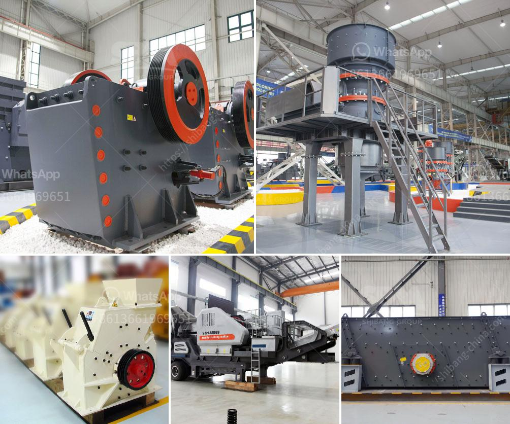

<h3>screw sand washing machine</h3>
In the realm of sand processing, the use of a screw sand washing machine is an indispensable piece of equipment used to remove dirt and dust particles, excess moisture, and undesirable impurities from sand. This efficient industrial-grade machine harnesses the principles of gravity and water to achieve its cleaning and washing capabilities.

The screw sand washing machine features a spiral blade system attached to the bottom of the tank. It has a higher cleaning ability than the traditional bucket-wheel sand washing machine, as it can effectively remove fine sand and stone powder. The discharged sand is of high quality and free of impurities. By adjusting the screw speed and water supply, operators can control the cleaning process to achieve the desired results.

Versatility is a notable advantage of the screw sand washing machine. From sand cleaning to dewatering to classifying, this machine is designed to cater to a wide range of sand processing requirements. It can handle various types of sands, including natural sand, artificial sand, crush sand, gravel, and more. This flexibility makes it an ideal choice for various industries such as construction, mining, and concrete production.

Besides its cleaning abilities, the screw sand washing machine is highly efficient. It can process large quantities of sand in a short amount of time, saving both time and labor cost. Furthermore, it features a compact design, making it easy to install in different locations, including sand plants, quarries, gravel pits, and construction sites.

Maintaining a screw sand washing machine is straightforward. Routine maintenance involves regularly checking the wear of the blades, repairing or replacing worn parts, and ensuring adequate lubrication of the machine. Doing so will help prolong its lifespan, ensuring continuous and efficient operation.

In conclusion, the screw sand washing machine is an essential tool for sand processing. It offers efficient sand cleaning, dewatering, and classifying functions, making it suitable for a variety of industries. Its versatility, high cleaning ability, and low maintenance requirements make it a valuable investment for businesses involved in sand processing.
<h3>Contact us</h3><ul><li><strong>Whatsapp:&nbsp;<a href="https://wa.me/8613661969651">+8613661969651</a></strong></li><li><a href="https://swt.shibang-china.com/?git&amp;zhl&amp;screw sand washing machine"><strong>Online Service(chat now)</strong></a></li></ul><h3>Related</h3><ul><li><a href='micro grinding mill.md'>micro grinding mill</a></li><li><a href='grinding machine for industrial use.md'>grinding machine for industrial use</a></li><li><a href='used ball mill in gujrat.md'>used ball mill in gujrat</a></li><li><a href='calcium carbonate grinding.md'>calcium carbonate grinding</a></li><li><a href='stone crusher plant hire gold in zimbabwe.md'>stone crusher plant hire gold in zimbabwe</a></li></ul>