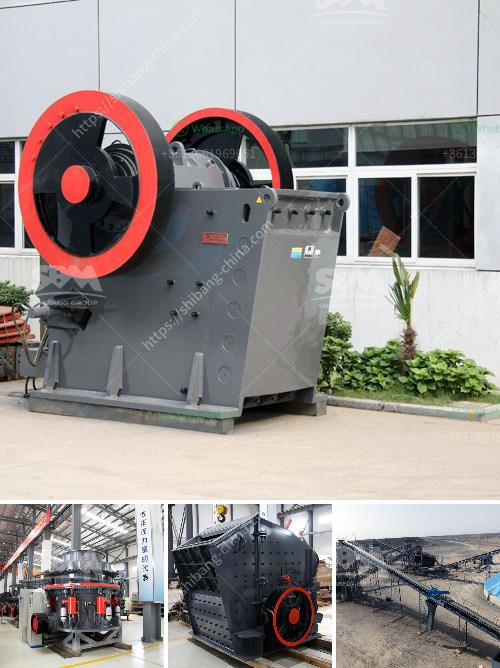

<h3>second hand conveyor belt adelaide</h3>
Conveyor belts are a vital component in numerous industries, facilitating the movement of goods and materials efficiently and effectively. In Adelaide, South Australia, businesses looking for an affordable option to meet their conveyor belt requirements often turn to second-hand conveyor belts. These belts, although previously used, can offer a cost-effective solution that meets industry demands without breaking the bank.

Second-hand conveyor belts, or used conveyor belts, are belts that have previously been used in various applications before being resold. When looking for second-hand conveyor belts in Adelaide, it is important to consider factors such as the condition, material, and suitability for specific industries.

One of the main advantages of opting for second-hand conveyor belts is the significant cost savings. New conveyor belts can be expensive, especially for small and medium-sized businesses that may have budget constraints. Investing in used conveyor belts allows businesses to access the functionality and efficiency of a conveyor system without the hefty price tag associated with new belts.

Adelaide, being a prominent industrial hub, houses a number of companies that specialize in the sale and distribution of second-hand conveyor belts. These companies thoroughly inspect and refurbish used belts to ensure they are in good working condition. The belts are cleaned, repaired if necessary, and tested for functionality and durability. This attention to detail guarantees that businesses purchasing second-hand conveyor belts in Adelaide are receiving a reliable and functional product.

Furthermore, the availability of different types and sizes of second-hand conveyor belts in Adelaide allows businesses to find the perfect fit for their specific industry needs. Whether it is for mining, agriculture, manufacturing, or any other sector, there is a wide range of used conveyor belts available to suit various applications. Additionally, businesses can often find belts with different features, such as different widths, lengths, and strengths, ensuring they can find a product that meets their specific requirements.

In terms of sustainability, opting for second-hand conveyor belts in Adelaide contributes to reducing waste and preserving resources. By giving used belts a second life, businesses are participating in a circular economy, minimizing their environmental impact. This aligns with the growing awareness and importance of sustainable business practices in today's society.

It is crucial, however, to approach the purchasing process with due diligence. Businesses must ensure they are dealing with reputable suppliers in Adelaide that specialize in used conveyor belts. These suppliers should have a good track record and offer warranties or guarantees for their products. Additionally, inspecting the belt thoroughly upon its arrival and conducting regular maintenance can help extend its lifespan and ensure optimal performance.

In conclusion, second-hand conveyor belts in Adelaide offer a cost-effective and sustainable solution for businesses looking to acquire a conveyor system or replace their existing belts. With the availability of various types and sizes, these belts provide the functionality and efficiency required in different industries. By choosing used conveyor belts, companies in Adelaide can achieve their operational needs while maintaining their budget and contributing to environmental sustainability.
<h3>Contact us</h3><ul><li><strong>Whatsapp:&nbsp;<a href="https://wa.me/8613661969651">+8613661969651</a></strong></li><li><a href="https://swt.shibang-china.com/?git&amp;zhl&amp;second hand conveyor belt adelaide"><strong>Online Service(chat now)</strong></a></li></ul><h3>Related</h3><ul><li><a href='ultrafine grinding mill.md'>ultrafine grinding mill</a></li><li><a href='ceramic ball mill.md'>ceramic ball mill</a></li><li><a href='hot selling coal mine roller crushing plant in india.md'>hot selling coal mine roller crushing plant in india</a></li><li><a href='sand washing system.md'>sand washing system</a></li><li><a href='jaw crushers 100tph.md'>jaw crushers 100tph</a></li></ul>