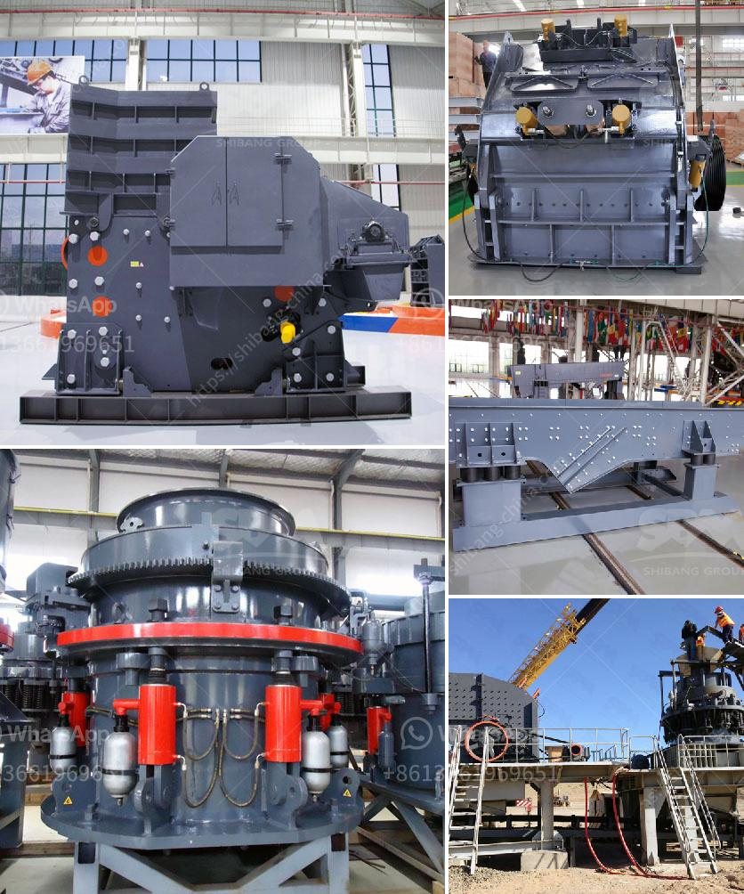

<h3>second hand dry cleaning machines uk</h3>
Second-hand dry cleaning machines have become increasingly popular in the UK. With more people looking for affordable alternatives to setting up a dry cleaning business, these machines offer a cost-effective solution. Whether you are just starting out or looking to expand your existing business, investing in a second-hand dry cleaning machine can save you a significant amount of money.

One of the main advantages of purchasing a used dry cleaning machine is its price. New machines can be expensive, especially for small business owners. However, buying a second-hand machine allows you to stay within budget while still providing a high-quality service to your customers. Many sellers offer refurbished machines that are in excellent condition, giving you the same functionality as a brand-new machine.

In addition to cost savings, another benefit of buying a used dry cleaning machine is the ability to quickly set up and start your business. As these machines are readily available, you don't have to wait for a long manufacturing process. Once you have purchased your machine, you can immediately begin offering dry cleaning services to your customers.

Moreover, the second-hand dry cleaning machine market in the UK is extensive, providing you with a wide range of options to choose from. You can find machines of various sizes and capacities, allowing you to select one that suits the specific needs of your business. Whether you require a small-sized machine for a boutique business or a larger one for an established dry cleaning service, you can easily find a suitable machine in the second-hand market.

However, it is important to consider a few factors when purchasing a second-hand dry cleaning machine. First, ensure that the machine is properly maintained and in good working condition. Request a demonstration from the seller to ensure that the machine meets your requirements. Additionally, consider the after-sales service and warranty offered by the seller to ensure peace of mind.

In conclusion, second-hand dry cleaning machines provide an affordable and convenient option for entrepreneurs in the UK. By purchasing a used machine, you can save money without compromising on quality. However, it is important to thoroughly evaluate your options and choose a reliable seller to ensure a successful purchase. With the right machine, you can establish or expand your dry cleaning business while keeping costs under control.
<h3>Contact us</h3><ul><li><strong>Whatsapp:&nbsp;<a href="https://wa.me/8613661969651">+8613661969651</a></strong></li><li><a href="https://swt.shibang-china.com/?git&amp;zhl&amp;second hand dry cleaning machines uk"><strong>Online Service(chat now)</strong></a></li></ul><h3>Related</h3><ul><li><a href='stone crushers suppliers.md'>stone crushers suppliers</a></li><li><a href='stone crusher sample business plan.md'>stone crusher sample business plan</a></li><li><a href='single super phosphate plants in germany.md'>single super phosphate plants in germany</a></li><li><a href='manufacturers of mobile crushing plants.md'>manufacturers of mobile crushing plants</a></li><li><a href='friendly gold mining equipment.md'>friendly gold mining equipment</a></li></ul>