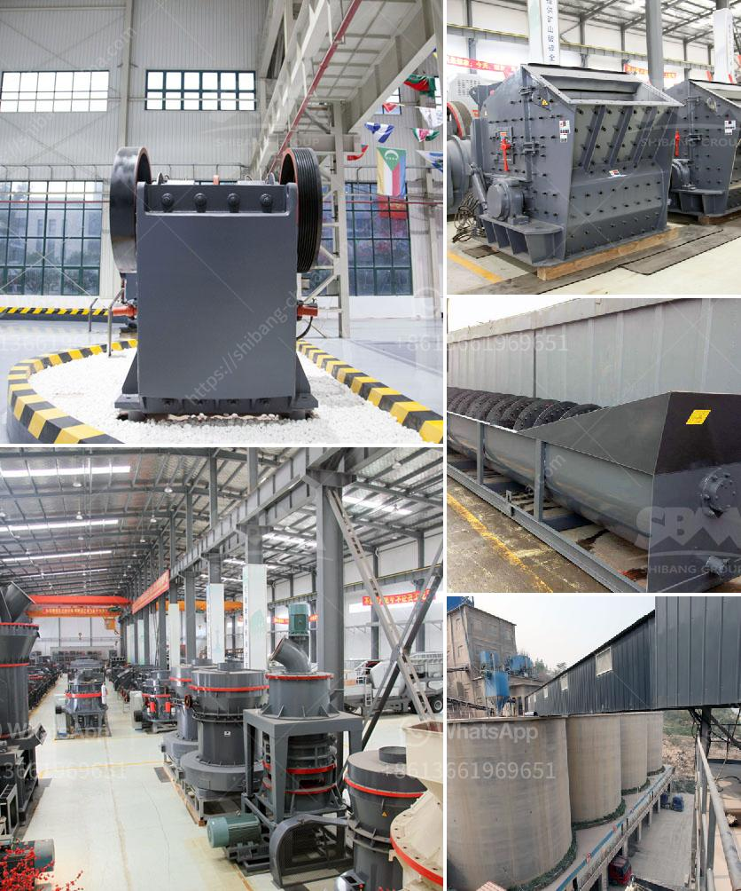

<h3>second hand sand mill in holland</h3>
The Netherlands, known for its picturesque windmills, tulip fields, and progressive mindset, has always been at the forefront of embracing sustainability. From renewable energy to circular economy initiatives, the Dutch have consistently strived for innovative and eco-friendly solutions. One such example is the thriving second-hand market for sand mills in Holland.

A sand mill is a machine used in the fluidized bed grinding process to disperse solids in a liquid medium. It plays a crucial role in various industries like paints, coatings, pigments, and dyes. Traditionally, the purchase of a sand mill involved investing a significant amount of money, discouraging smaller businesses or startups from acquiring this essential machinery.

However, the Dutch, with their focus on sustainability and circular economy principles, found a way to address this issue - second-hand sand mills. Instead of discarding or keeping unused equipment in storage, industrial businesses in Holland have embraced the concept of selling or buying pre-owned sand mills, thus reducing waste and contributing to a more sustainable industrial landscape.

The second-hand market for sand mills in Holland has several advantages. Firstly, it helps smaller businesses gain access to high-quality machinery at a fraction of the original cost. By purchasing second-hand equipment, startups or smaller companies can invest their limited funds in other areas crucial to their growth, such as marketing, research and development, or expanding their workforce. This not only fosters a more competitive market but also promotes innovation and economic development.

Secondly, the sale and purchase of second-hand sand mills contribute to a circular economy. By extending the lifespan of these machines, Holland reduces the environmental impact associated with manufacturing new equipment. The well-maintained second-hand sand mills go through a rigorous inspection process before being resold, ensuring their reliability and quality. This sustainable approach serves as an excellent example for other industries worldwide to follow.

Moreover, the second-hand market benefits the sellers as well. Instead of leaving old or unused sand mills collecting dust in a warehouse, companies can now retrieve a portion of their initial investment by selling them to eager buyers. This not only frees up valuable storage space but also reduces the financial burden of maintaining or disposing of obsolete machinery. Thus, the second-hand market offers a win-win situation for both buyers and sellers and contributes to a more efficient and sustainable industrial environment.

The success of the second-hand sand mill market in Holland has attracted international attention. Industrial players from various countries have started considering this approach, acknowledging its benefits for both their financial bottom line and their commitment to sustainability. By adopting a similar model, these industries can not only reduce their environmental footprint but also foster a circular economy.

In conclusion, the second-hand sand mill market in Holland exemplifies the Dutch commitment to sustainability and circular economy principles. This thriving market not only offers smaller businesses access to essential machinery at lower costs but also contributes to reducing waste and environmental impact. By extending the lifespan of sand mills, Holland showcases a sustainable solution that can be emulated by industries worldwide. Let us learn from their example and contribute to building a more sustainable future.
<h3>Contact us</h3><ul><li><strong>Whatsapp:&nbsp;<a href="https://wa.me/8613661969651">+8613661969651</a></strong></li><li><a href="https://swt.shibang-china.com/?git&amp;zhl&amp;second hand sand mill in holland"><strong>Online Service(chat now)</strong></a></li></ul><h3>Related</h3><ul><li><a href='iron ore processing equipment china for sale.md'>iron ore processing equipment china for sale</a></li><li><a href='granite crushing machine for sale.md'>granite crushing machine for sale</a></li><li><a href='lafarge evander quartz crushers.md'>lafarge evander quartz crushers</a></li><li><a href='zhauns south africa price list pdf.md'>zhauns south africa price list pdf</a></li><li><a href='indonesia hammer mill for sale.md'>indonesia hammer mill for sale</a></li></ul>