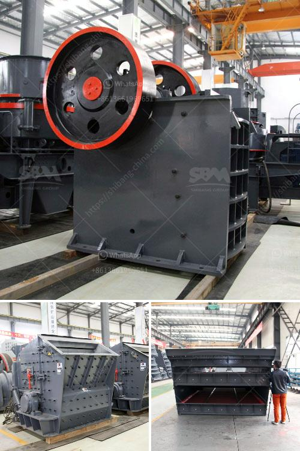

<h3>second hand stone crushing machines in united kingdom</h3>
As an experienced and reputable stone crushing machine supplier, we offer a range of second hand stone crushing machines for sale in United Kingdom. We provide economical and reliable stone crushers, as well as expert advice on which machine would be ideal for your operation.

Stone crushing machines are used in a wide range of industries, including mining, construction, and recycling. In order to deliver optimal performance, these machines are designed to crush stones into smaller pieces or even into fine dust, as per the specific requirements of the client.

There are numerous benefits associated with using second hand stone crushing machines in the United Kingdom. These machines offer high productivity, low maintenance costs, and reliable performance. Additionally, with the increasing environmental concerns, using recycled materials in construction projects is becoming a norm. By purchasing second hand stone crushing machines, one can contribute to the reduction of natural resource depletion, thereby conserving the environment.

When it comes to selecting the right machine, various factors need to be considered. The primary factor is the type of stone being crushed. Different stones have different hardness levels, and this determines the type of machine best suited for the job. For example, for softer stones, cone crushers are ideal, while for harder stones, jaw or impact crushers may be more suitable.

Another crucial consideration is the desired output size. The stone crushing machine chosen should be able to produce the desired product size efficiently. Crushers come with different settings that allow for adjustment of the output size as per the requirements of the project.

In addition to the technical specifications, it is equally important to inspect the machine thoroughly before making a purchase. This includes checking the condition of the machine, the maintenance history, and ensuring that all necessary safety features are in place. It is recommended to involve a professional engineer or technician during the inspection process to avoid any future complications.

Furthermore, a reliable supplier will provide assistance in terms of transportation and installation of the machine. They will ensure that the machine is delivered safely to the site and that it is properly set up for operation.

In conclusion, second hand stone crushing machines offer an affordable and environmentally friendly option for achieving high productivity and reliable performance. By choosing the right machine for your specific needs and inspecting it thoroughly, you can ensure a successful stone crushing operation. In the United Kingdom, there are reputable suppliers available to offer a range of second hand stone crushing machines, along with expert advice and support throughout the process.
<h3>Contact us</h3><ul><li><strong>Whatsapp:&nbsp;<a href="https://wa.me/8613661969651">+8613661969651</a></strong></li><li><a href="https://swt.shibang-china.com/?git&amp;zhl&amp;second hand stone crushing machines in united kingdom"><strong>Online Service(chat now)</strong></a></li></ul><h3>Related</h3><ul><li><a href='200 tph rock crusher.md'>200 tph rock crusher</a></li><li><a href='multi hammer crusher.md'>multi hammer crusher</a></li><li><a href='stone crusher manufacturer turkey.md'>stone crusher manufacturer turkey</a></li><li><a href='jaw crusher 200 tonnes per hour.md'>jaw crusher 200 tonnes per hour</a></li><li><a href='vertical mill machine in cement industry.md'>vertical mill machine in cement industry</a></li></ul>